# Software Design X-Rays: Fix Technical Debt with Behavioral Code Analysis

## Capítulo 1: Por que dívida técnica não é técnica

### A taxa de interesse é uma função do tempo

Só porque um código é ruim não quer dizer que é dívida técnica. Não é dívida técnica até termos que prestar atenção nele, e a taxa de interesse é uma função do tempo.
Precisaríamos saber qual a frequência de modificação (e leitura) de cada pedaço de código para separar a dívida que importa para a nossa habilidade de manter o sistema do código que pode ser importante, mas não nos impacta.

### Seus modelos mentais do código

Um dos aspectos mais desafiadores da programação é que precisamos servir duas audiências: a máquina que executa nosso programa, que não se importa com o estilo mas é bem chato em relação ao conteúdo; e os programadores mantendo o código, que tem um processo mental mais elaborado e precisa da nossa ajuda para usar esses processos de forma eficiente. É por isso que focamos em escrever códigos expressivos e bem organizados.

Um esquema é uma construção teórica usada para descrever a forma com que organizamos conhecimento na nossa memória e como usamos esse conhecimento para um evento em particular.

### A qualidade sofre com desenvolvimento paralelo

A estrutura de desenvolvimento de uma organização é um preditor mais forte de defeitos que qualquer métrica de código.
O risco de que um commit em específico introduz um efeito aumenta com o número de desenvolvedores que trabalharam anteriormente no código modificado.

### Mine a inteligência coletiva da sua organização

Como descobrir as áreas que precisam de melhoria? Idealmente, precisamos das seguintes informações:
- Onde está o código com maior taxa de interesse?
- Nossa arquitetura suporte a forma como nosso sistema evolui?
- Existem gargalos de produtividade para coordenação entre os times?
  Nossos dados de controle de versão são uma mina de ouro de informação. Mas é uma mina de ouro que raramente nos aprofundamos.

### Priorize melhorias guiadas por dados

Para melhorar, precisamos priorizar a forma com que realmente trabalhamos com o código, e priorizar dívida técnica requer uma dimensão de tempo na nossa base de código.

Nossa liberdade de código é fortemente restrita se tentarmos refatorar um módulo que está sob desenvolvimento constante com um grupo de programadores comparado com um pedaço de código que trabalha isolado. A não ser que levemos o lado social da nossa base de código em conta, vamos falhar em identificar custos de manutenção significativos.

https://martinfowler.com/bliki/TechnicalDebtQuadrant.html

## Capítulo 2: Identifique código com maior taxa de interesse

### Meça as taxas de interesse

Esses gráficos apresentam uma visão evolucionária de três bases de código diferentes. Organizamos os arquivos de cada base de código de acordo com suas frequências de alteração - ou seja, o número de commits feitos em cada arquivo gravado no controle de versão, com o eixo Y mostrando o número de commits.

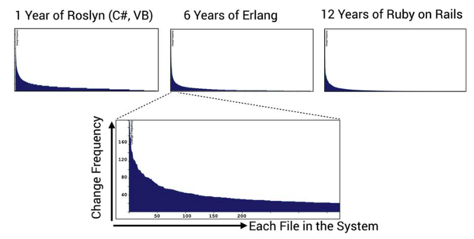

Eles mostram uma power law distribution.

A distribuição significa que a maioria do nosso código está na cauda longa. É código que raramente é tocado. De forma bem simplista, essa característica sugere que a maioria do nosso código não é importante da perspectiva de custo ou qualidade. Em comparação, a maior parte da atividade de desenvolvimento é focada em uma parte relativamente pequena da base de código. Isso nos dá uma ferramenta para priorizar melhorias, como a figura a seguir ilustra.

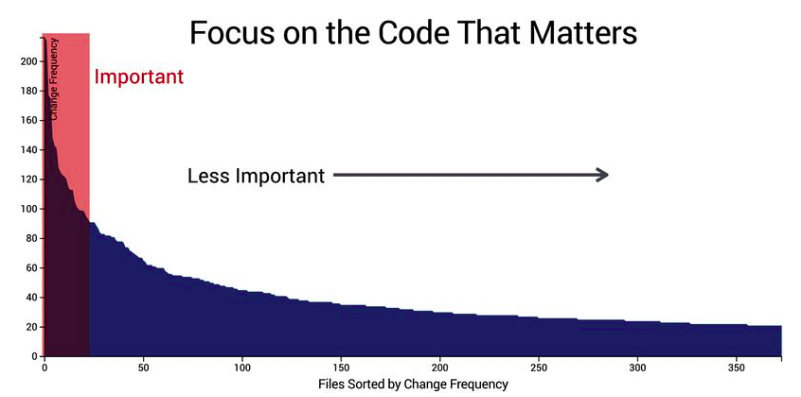

Na prática, mais frequentemente que o contrário, arquivos com maior frequência de alterações sofrem de problemas de qualidade.

### Uma fórmula para a taxa de interesse

Você só precisa contar o número de vezes que cada arquivo foi referenciado no seu log do Git e organizar os resultados.

```bash
git log --format=format: --name-only | egrep -v '^S' | sort \ | unq -c | sort -r | head -5
```
O `--format=format:` dá uma lista de todos os arquivos já alterados. O `egrep -v` limpa nossos dados removendo linhas em branco do comando anterior e o resto conta as frequências de alteração e mostram os resultados em ordem.

Para salvar tudo em um arquivo, basta colocar `> arquivo.txt` no final.

Os arquivos que atraem a maior parte das alterações são aqueles que são centrais no sistema.

### A eficácia das frequências de alteração

Nossas frequências de alteração nos permite identificar o código que fazemos a maior parte do trabalho e também apontam possíveis problemas de qualidade.
Apesar dessas descobertas, o modelo ainda tem fraquezas, porque todo código é diferente. Há uma diferença enorme em aumentar o número da versão em uma linha e corrigri um bug em um módulo de cinco mil linhas.
A vantagem de usar linhas de código é a simplicidade.

### Priorize dívida técnica com hotspots

Um hotspot é código complicado que precisa ser alterado constantemente. Hotspots são calculados com a combinação de duas métricas que exploramos:
1. Calculando a frequência de alteração de cada arquivo com a taxa de interesse
2. Usando linhas de código como medida simples de complexidade de código

Enclosure diagram

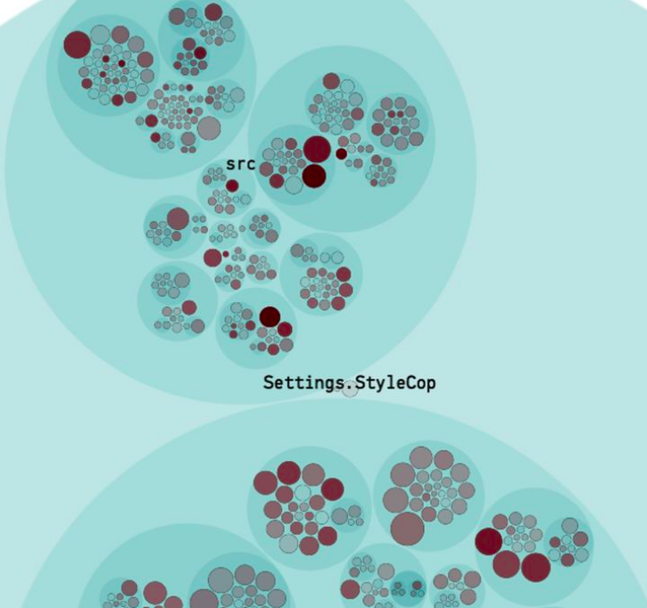

Eles crescem com o tamanho da básica de código. É possível interpretar de duas formas:
- Hierárquica: segue a estrutura de pasta da sua base de código. Veja os círculos azuis grandes na figura. Cada um deles representa uma pasta da sua base de código. Círculos aninhadosrepresentam subpastas.
- Interativo: trabalhar com bases de código grandes precisa ser interativo. Isso significa que você pode aumentar a  área de interessee clicando em um dos círculos.

### Avalie os hotspots com tendências de complexidade

Podemos descobrir quão severo um problema em potencial é através da análise de tendências de complexidade, que procura por complexidade acumulada de um arquivo no decorrer do tempo.

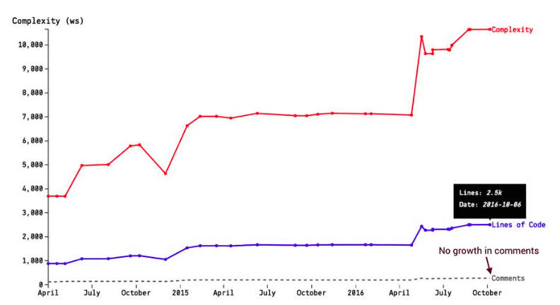

As linhas de código provavelmente crescem com o tempo, mas a comlexidade de cada linha cresce mais rápido.

### Use os Raios X para se aprofundar no código

Você pode capitalizar nesse aspecto executando uma análise de hotspot no nível d emétodo para identificar segmentos de código que contribuiem para a maioria do arquivo ser um hotspot. Vamos referenciar essa análise como Raio X para distinguir das análises a nível de arquivo.

Um Raio X te dá uma lista priorizada de métodos para inspecionar e, possivelmente, refatorar.

Uma análise Raio X envolve:
1. Obter o código fonte de cada revisão de histórico do nosso hotspot do Git
2. Executar um `git diff` de cada revisão subsequente do código. A saída nos mostra onde - no arquivo histórico - os desenvolvedores fazem modificações.
3. COmparamos os resultados as funções/métodos que existem naquela revisão em particular. Isso significa que precisamos explorar o código fonte para saber quais funções foram afetadas em um commit específico.
4. Fazer o cálculo de hotspot no conjunto resultando das funções alteradas em todas as revisões do hotspot. O algoritmo é idêntico ao usado no nível de arquivo, mas o escopo difere. A frequência de alteração representa o número de vezes que modificamos uma função, e o tamanho da função nos dá a dimensão de complexidade.

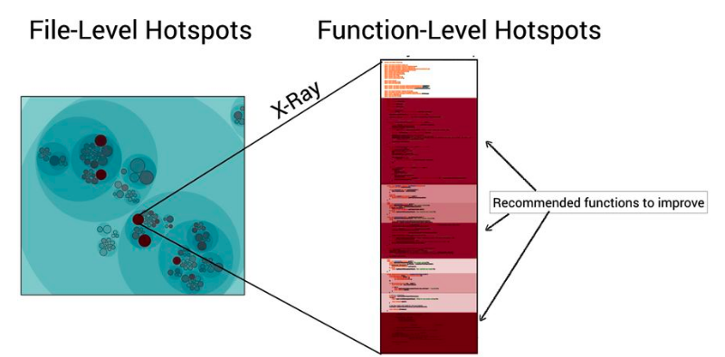

### Inspecione o código

A vitória com uma análise hotspot é que ela nos permite minimizar os esforços manuais enquanto certificamos alta probabilidade de forcamos nas partes corretas do código.

Casos de acoplamento de controle através de booleados são um problema já que introduzem lógica condicional e diminuem a coesão forçando estado adicional. Tal controle também leva a duplicações de código sutis. Essas escolhas de design não são boas na manutenção.

### Escape da armadilha da dívida técnica

Se as pessoas conseguirem descifrar hieróglicos e a sequência do genoma humano, também deve ser possível entender bases de código legado.

Há vários motivos pelos quais código cresce em hotspots. O motivo mais comum é baixa coesão, o que significa que o hotspot contém diversas partes não relacionadas e falta modularidade. Eles atraem muitos commits porque têm muitas responsabilidades.

## Capítulo 3: Acoplamento no tempo: uma heurística para o conceito de surpresa

### Detecte arquivos que são alterados em conjunto

Com o hierarchical edge bundle:

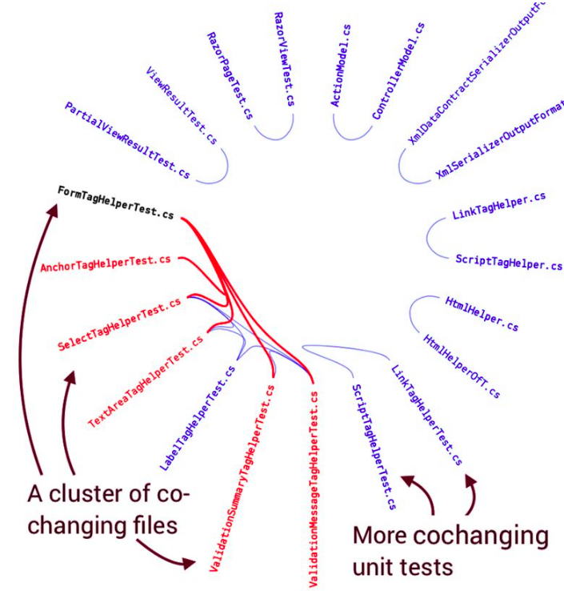

### O segredo do copia-e-cola

Copiar e colar pode não ser o problema se dois pedaços de código evoluem em direções diferentes. Se não o fizerem - se continuarmos modificando ambas as partes - temos um problema.

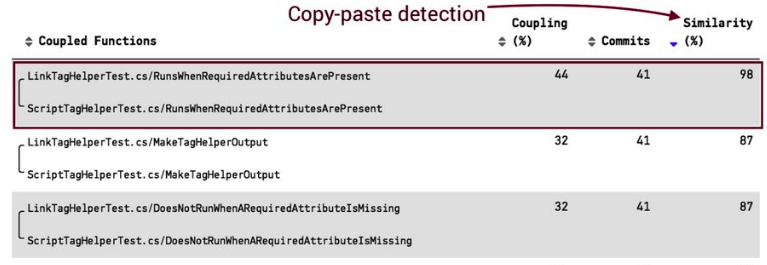

Uma vez que identifiquemos os clones de software que importam, precisamos refatorá-los. A abordagem de refatoração é a extração do padrão repetido em um novo método parametrizando o conceito que varia. Isso torna o código um pouco mais barato de manter enquanto nossa dependência temporal desaparece.

## Capítulo 4: Pague sua dívida técnica

Mesmo com diversas técnicas de refatoração, precisamos considerar o lado das pessoas no código, também.

### Siga o princípio da proximidade

O princípio da proximidade foca em quão bem organizado seu código é em relação a legibilidade e mudança. A proximidade implica que funções que mudam juntas devem ser movidas para perto. A proximidade é tanto um princípio de design e uma heurística para refatorar hotspots para um código que é mais fácil de entender.

Melhoramos o código, como a figura ilustra, movendo os métodos semelhantes para perto uns dos outros.

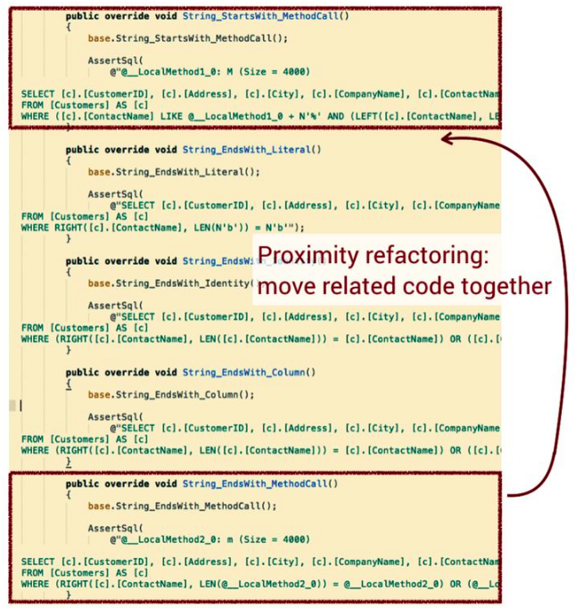

Ao ordenarmos nossas funções e métodos de acordo com nossos padrões de mudança, comunicamos a informação que não é expressa na sintaxe da linguagem de programação.

A principal vantagem de uma refatoração por proximidade é que tem risco baixo. Se você detectar código copia-e-cola no dia de um prazo crítico, pode não ser a hora certa de abstrair a duplicação.

Para manter uma estrutura amigável para as pessoas, você precisa manter essas funções relacionadas próximas umas das outras no seu código fonte.

### Refatore código congestionado com o padrão splinter

O padrão splinter providencia uma forma estruturada de quebrar os hotspots em pedaços gerenciáveis que podem ser divididos entre várias pessoas para que possam trabalhar, ao invés de ter um grupo de desenvolvedores trabalhando em um pedaço grande de código.

O principal motivo pelo qual um pedaço de código cresce em hotspots é porque acumula diversas responsabilidades centrais. Como consequência, o hotspot tem muitas formas de mudar.

### O desenvolvimento em paralelo conflita com a refatoração

O padrão splinter resolve esse dilema reconhecendo que refatorar um hotspot é um processo iterativo que é aplicado em diversas encarnações do código. Em uma refatoração splinter você não precisa melhorar a qualidade de código dessa forma, mas ao invés disso transformar o código em uma estrutura onde divesas pessoas podem trabalhar juntas em paralelo em direção ao objetivo geral de refatoração.

### Separe um arquivo hotspot em responsabilidades

A intenção do padrão splinter é quebrar um hotspot em partes menores em relação a suas responsabilidades enquanto mantém a API original no período de mudança.

Segue as etapas por trás da refatoração splinter iterativa:

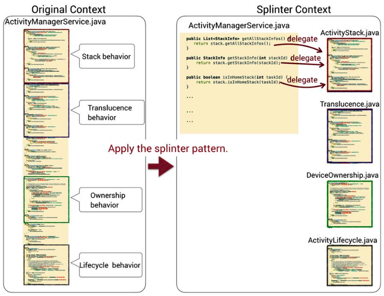

1. Tenha certeza que seus testes cobrem o candidato a splinter. Se não tiver uma suite de testes adequada - poucos hotspots têm - você precisa criar uma;
2. Identifique os comportamentos dentro do seu hotspot. Essa etapa é um exercício de leitura de código onde você analisa os nomes dos métodos dentro do hotspot e identifica códigos que formem grupos de comportamentos;
3. Refatore por proximidade. Agora você forma grupos de funções com comportamento relacionado dentro do arquivo maior, baseado em comportamentos que você identificou antes. Essa refatoração por proximidade torna sua próxima etapa muito mais fácil;
4. Extraia um novo módulo para o comportamento com maior atividade de desenvolvimento. Use uma análise Raio X para decidir por onde começar, então copie e cole seu grupo de métodos em uma nova classe deixando o original intocado. Lembre de colocar um nome descritivo no seu novo módulo para capturar seu propósito;
5. Delegue para o novo módulo. Substitua o corpo dos métodos originais com delegações para seu novo módulo. Isso permite que você evolua mais rapidamente, o que limita o risco de mudanças conflitarem para outras pessoas;
6. Execute os testes de regressão necessários para certificar que você não tenha alterado o comportamento do sistema. Commite suas mudanças quando os testes passarem;
7. Selecione o próximo comportamento para refatorar e comece na etapa 4. Repita as etapas splinter até que tenha extraído todos os hotspots críticos que identificou na análise Raio X.

A chave para uma refatoração splinter de sucesso é priorizar sua próxima etapa com dados evolucionários, porque não há como refatorar um hotspot principal de uma só vez.

### Saiba as consequências dos splinters

Uma refatoração splinter cria um novo contexto onde você lida com um problema maior quebrando-o em partes menores.

### Crie testes temporários como rede de segurança

Para um hotspot gigante é difícil construir uma suite de testes que cubra boa parte dos casos. Em situações como essa, você precisa construir uma rede de segurança baseada em testes end-to-end. Esses testes focam em capturar cenários performados no nível no sistema. Isso significa que são executados com uma base de dados, conexões de rede, UI, e outros componentes do sistema de verdade.
Os testes end-to-end te dão uma cobertura de testes boa o suficiente para servirem como suite de regressão, e essa suite te permite fazer a refatoração inicial sem quebrar um comportamento fundamental.

O truque é tratar o código como uma caixa preta e só focar no comportamento visível.

Depois, meça a cobertura de teste da sua suite e procure por caminhos de execução que não foram cobertos com alta complexidade. Use essa informação de cobertura como feedback para completar seus testes e grave testes adicionais para cobrir caminhos de execução faltano. Você também pode fazer uma nova mental de extrair esse comportamento em seu próprio módulo splinter.

### Reduza a dívida removendo custos

É comum encontrar hotspots com cobertura de testes inadequada. Isso não significa que não existam testes, só que não existem testes aonde eles precisam estar.
É melhor apagar os testes nesse caso.

### Transforme os métodos do hotspot em pedaços amigáveis para pessoas

Nomear nossos construtores de programação é uma técnica poderosa que lida com o fator mais limitador da programação - nossa memória funcional.
A memória funcional é uma construção cognitiva que serve como espaço de trabalho do seu cérebro. Ela te permite integrar e manipular informação na sua cabeça. A memória funcional também é limitada em recurso e tarefas de programação a levam ao máximo.
Otimizar código para programadores entenderem é uma das escolhas mais importantes que fazemos.

### Pedaços

Mestres de xadrez não se lembram de peças individuais. Eles lembram de padrões, que são representados como grupos de peças. Psicólogos cognitivos chamam esses grupos de chunks, e chunks também funcionam para código.

Quando separar um método hotspot em um grupo de chunks, considere deixar o código como está e siga com uma análise Raio X no seu código refatorado um mês depois. As chances são que a maioria dos seus chunks continuaram estáveis, o que significa que você pode ignorá-los e focar seus esforços de refatoração nas partes que continuam a evoluir.

### A maldição do sistema de sucesso

Escrever código sempre envolve explorar e enetender ambos os domínios do problema e da solução. Logo, é inevitável que sigamos o caminho errado de vez em quando, e a pressão de completar uma funcionalidade torna difícil parar e voltar atrás.

Isso não deve acontecer se prestarmos atenção na nossa base de código e tomar as medidas certas quando necessário.

## Capítulo 5: Os princípios da idade de código

### Estabilize código por idade

Desenvolver com código antigo como um guia significa que:
1. Organizamos nosso código por tempo de existência;
2. Transformamos pacotes estáveis em bibliotecas;
3. Movemos e refatoramos código que falhamos em estabilizar.
Seguir esses princípios nos dá uma série de vantagens:
- Promove modelos de memória a longo prazo;
- Diminuir a carga cognitiva já que há menos código ativo;
- Prioriza suites de testes para diminuir tempo útil.

Para identificar a idade do arquivo, usamos o seguinte comando:

```bash
git log -1 --format="%ad" --date=short \-- <arquivo>
```

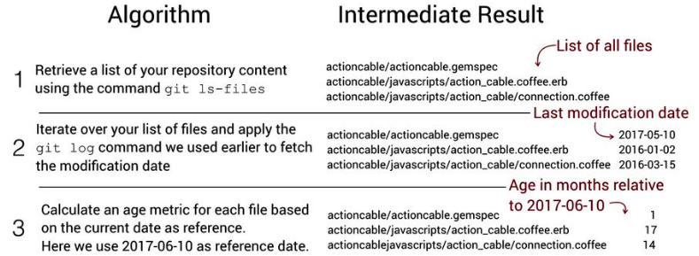

Obtemos uma lista de todos os arquivos no repositório com sua última modificação e finalmente calculamos a idade de cada arquivo.

### As três gerações de código

Dan North diz que queremos que nosso código ou seja muito recente ou muito antigo, e o tipo de código que é difícil de entender fica entre esses dois extremos.

Tentemos a esquecer em uma taxa exponencial.

A figura a seguir mostra a curva do esquecimento de Ebbinghaus, onde esquecemos rapidamente informações aprendidas desde o primeiro dia. Para reter informaçõs precisamos repeti-la, e com cada repetição somos capazes de melhorar nossa performance lembrando mais.

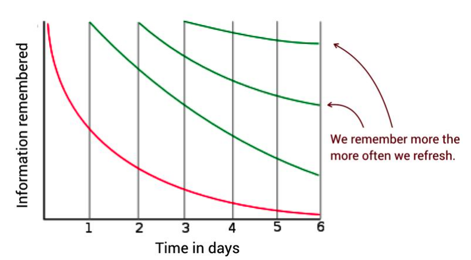

Código recente é o que estendemos e modificamos agora, o que significa que temos um modelo mental fresco do código e sabemos como ele funciona. Em comparação, código antigo é por definição estável, o que significa que não precisamos modificá-lo, nem precisamos manter informação detalhada sobre seu funcionamento interior. É uma caixa preta.
Essa curva também explica por que o código que não é nem antigo nem novo é problemático; tal código é onde esquecemos muitos detalhes e precisamos revisitá-lo de vez em quando. Cada vez que revisitamos esse meio termo precisamos reaprender seu funcionamento, o que se torna um curto de tempo e esforço.
Também há um lado social da idade do código no sentido de que quanto mais antigo o código, mais provável que o programador original tenha deixado a organização. Isso é particularmente problemático para o código intermediário - o código que falhamos em estabilizar - porque significa que, como organização, temos que modificar código que não conhecemos.
A primeira cirurgia ignorante (David Parnas) é um convite para outros fazerem o mesmo. Com o tempo o código se tornar mais difícil de entender, o que nos deixa com dívida técnica que vem do fator organizacional de falha em manter domínio do sistema. Tal código também se torna frágil, o que significa que é importante estabilizar código do ponto de vista de qualidade também.

### Refatore código de idades parecidas

Vamos colocar os números em uma planilha e gerar um histograma como o que vemos nessa figura.

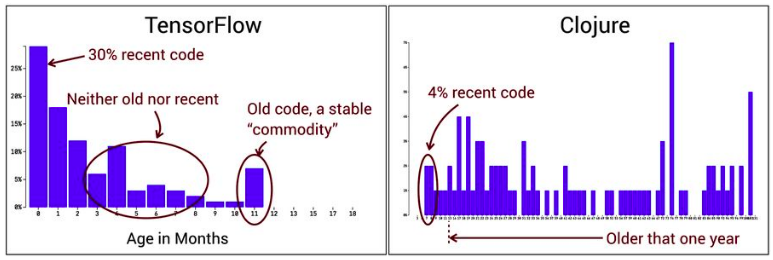

A idade do código é uma heurística. Isso significa que os resultados da análise não vão tomar decisões por nós, mas vai nos guiar para perguntar as questões corretas.

O ponto positivo de análises de software evolucionárias é que elas nos dão feedback que nos ajudam a lidar com o gap entre o estado atual do código e onde queremos estar.

## Capítulo 6: Identifique o ponto de inflexão do seu sistema

### Software é muito difícil?

O cérebro humano não evoluiu para programar.

Conseguimos fazê-lo porque humanos são ótimos em workarounds, e várias práticas que usamos para programar são feitas a mão para esse propósito. Abstração, coesão, e bons nomes nos ajudam a expandir o tanto de informação que podemos obter na nossa memória funcional e servem como atalhos mentais para ficar contra a curva de esquecimento de Ebbinghaus.

### Aumente  o nível de abstração

A escala de uma base de código deve refletir tanto a organização de pessoas e a arquitetura do sistema.

### Divida e conquista com hotspots de arquitetura

1. Identifique seus limites de arquitetura. Às  vezes esses limites estão documentados e, se tiver sorte, a documentação pode até estar correta. Se não, você precisa fazer engenharai reversa para descobrir os limites, e um bom ponto inicial é se basear nele na estrutura de pastas da base de código;
2. Execute uma análise de hotspot no nível de arquitetura. Isso te permite identificar os subsistemas com o maior esforço de desenvolvimento e visualizar a tendência de complexidade de um componente arquitetural inteiro;
3. Analise os arquivos em cada hotspot arquitetural. Nessa etapa vamos voltar aos arquivos individuais, mas nosso escopo de análise é menor já que focamos em um subsistema por vez.

### Uma linguagem para especificar limites arquiteturais

Usamos o comando a seguir para listar os 10 arquivos mais modificados dentro de um período de tempo:

```bash
git log --format=format: --name-only --after=2016-01-01 | sort | uniq -c | sort -r | head -10
621 MAINTAINERS
542 drivers/gpu/drm/i915/intel_display.c
503 drivers/gpu/drm/i915/i915_drv.h
343 drivers/gpu/drm/i915/i915/i915_gem.c
...
```

A primeira etapa é identificar os limites arquiteturais. Esses limites arquiteturais representam nossos componentes lógicos. Um componente lógico é uma construção que agrega diversos arquivos em uma unidade de análise que carrega significado em um nível arquitetural.

Lembre-se que só porque algum código é um hotspot, isso não significa que é um problema. Ao invés disso, um hotspot significa que amos identificar uma parte do código que requer nossa atenção, já que atrai diversas alterações. E quanto mais algo é alterado, mais importante é que o código correspondente seja de alta qualidade para que todas as mudanças são simples e de baixo risco.

Quanto mais esperarmos por essa refatoração, pior será, conforme evidenciado pela tendência de complexidade crescente.

Para especificar o nome da função no git log:

```bash
git log -L:<função>:<caminho do arquivo>
```

Em um sistema grande você pode - e deve - permitir que desenvolvedores diferentes trabalhem melhorando partes diferentes do código em paralelo. Envolver mais desenvolvedores em refatoração para deixá-los observar as alterações no código existente e permiti-los ver os efeitos das melhorias. Nós, humanos, criamos conhecimento em domínios complexos mexendo neles, e refatorar código é uma oportunidade excelente para melhorar as habilidades do seu time.

### Tenha um X9

A normalização do desvio é um motivo pelo qual X9s são importantes em uma organização.

1. Defina um intervalo simples - po exemplo, uma vez por mês;
2. Calcule uma tendência de complexidade para cada arquivo no componente lógico com pontos de exemplo nas datas dadas pelo intervalo decididas na etapa anterior;
3. Agregue as tendências individuais em uma única tendência.

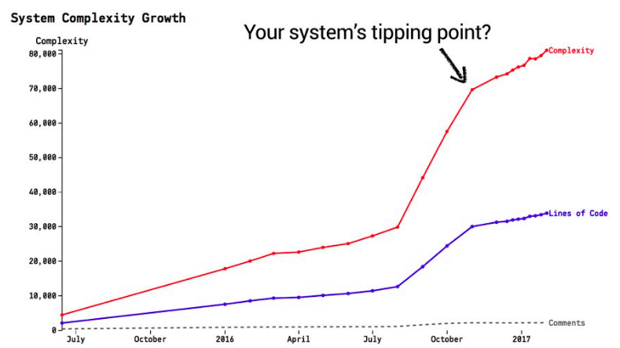

Tendências como essas também servem como sinal de aviso; adicionar mais pessoas a um sistema que a complexidade cresce rapidamente pode ser desastroso, então use essas tendências como base para decisões organizacionais também.

Usado dessa forma, as tendências de complexidade nos ajuda a detectar, e possivelmente prever, quando nosso sistema chega no seu ponto de inflexão - a partir disso se torna um pesadelo de manutenção. Outro uso de tendências agregadas é que eles nos permitem manter controle dos efeitos da refatoração que separam um arquivo em diversos.

Com o tempo podemos esperar uma refatoração com sucesso para reduzir a complexidade geral de um pacote inteiro, e tendências agregadas nos permitem isso.

Como desenvolvedores, estamos cientes dos módulos problemáticos, mas sem tendências visuais estamos destinados a deixar passar quão sérios esses hotspots são e quanto tempo desperdiçamos em manter código que é mais complexo do que deveria.

Assim que executamos uma análise de tendência de complexidade, fica óbvio que nós - como organização - devíamos ter investido em melhorias de cóodigo anos atrás. Podemos salvar nossos futuros eus reagindo hoje.

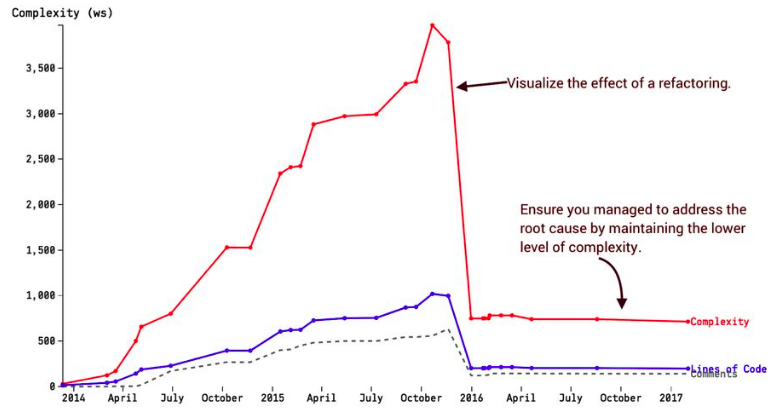

Gestores escutam; só precisamos dar a eles uma chance de entender as dores de algo tão técnico quanto código para que possam equilibrar essa informação com outroos trade-offs. Dados obtém confiança.

## Capítulo 7: Além da Lei de Conway

Nãoo podemos dizer apenas com o código se um pedaço de código é um gargalo de produtividade para cinco times diferentes.

### Desenvolvimento paralelo no Linux

Queremos investigar se isso também representa um gargalo de coordenação em relação a quantos autores precisam trabalhar nele. Aspectos sociaisi são um pouco mais complexos para medir, então vamos passo a passo.

O ponto inicial é contar o número de desenvolvedores que contribuem para cada componente lógico.

```bash
git shortlog -s
8 D. Cooper
7 Bob
2 N. Cross
```

É possíver usar a opção `-s` para obter uma lista com a contagem total de commits por autor.

```bash
git shortlog -s --after=2016-09-19 -- <pasta> | wc -l
```

### Ranqueie o código por difusão

Nossa meta é providenciar uma análise que ranqueie todos os módulos na nossa base de código do quão difuso nosso esforço de desenvolvimento é, e então usar como um proxy para necessidades de coordenação.

### Reaja a fragmentação de desenvolvedores

- Priorize revisões de código. Revisões de código são técnicas que removem defeitos, ams vêm com um custo. Conforme sua organização cresce, a fadiga do revisor de código se torna real. Dado o que sabemos sobre defeitos, devemos priorizar revisões de código de mudanças feitas por contribuidores menores;
- Foque em testes. Calcule valores fractais para identificar as áreas de código onde você precisa focar em testes extra;
- Replaneje funcionalidades sugeridas. Antes de começar uma nova funcionalidade, meça a fragmentação de desenvolvimento no decorrer das últimas semanas. Se o seu trabalho planejado envolver uma área de código com congestão alta de desenvolvedores, você pode pagar para replanejar e atrasar o início da implementação da feature nova;
- Redesesenvolva para aumentar o paralelismo. Em um sistema maior, você precisa otimizar o desenvolviimento para trabalho paralelo, então use os valores fractais para identificar candiidatos para refatorações splinter permitindo que pessoas trabalhem mais independentemente;
- Introduza áreas de responsabiilidade. Quando você visualizar padrões de desenvolvedores você dá a gestores não técnicos insights do trabalho de desenvolvimento, dando a chance de reacessar as formas atuais de trabalho, talvez introduzindo equipes que estão alinhadas com a estrutura da base de código.


### Propriedade de código e difusão de responsabilidade

O tipo de perda de processo que ocorre depende da tarefa, mas em uma colaboração intensiva como software, a maior parte da perda de processo é devido à comunicação e coordenação além da conta.
Um dos motivos mais importantes por trás da difusão de responsabilidade é que em grupos maiores não temos senso pessoal de responsabilidade, e assumimos que alguém mais vai reagir e ajudar. A consequência é que a definição do grupo nos ajude de forma que não faríamos sozinhos.
Para contradizer esses efeitos precisamos sentir que nossas contribuições individuais fazem a diferença. Bom código tem um senso pessoal de responsabilidade que todos se envolvam.
Ao mesmo tempo, tal código geralmente não é tão difícil em refatorar, então por que isso não aconteceu? Por que projetos permitem que seus componentes principais deteriorem de qualidade, ano após ano?

### Propriedade de código significa responsabilidade

Propriedade de código pode ser um tópico controverso enquanto algumas organizações movem para modelos onde todo desenvolvedor é esperado para trabalhar em todas as partes da base de código. A ideia de propriedade de código invoca a ideia de silos de desenvolvimento onde o conhecimento é isolado na cabeça de um único indivíduo. Então vamos ser claros sobre isso: quando falamos sobre prioridade, não quermos dizer sobre a propriedade no sentido de "Esse código é meu - fique longe." Ao invés disso, propriedade é um mecaniismo para contradizer a difusão de responsabilidade, e isso sugere que alguém tome a responsabilidade pessoal para a qualidade e futuro de um pedaço de código.

### Providencie limites de conhecimento amplos

Essas descobertas não significam que você deva parar de compartilhar conhecimento entre pessoas e equipes, e sim o contrário. Isso significa que precisamos diferenciar nossos limites operacionais (as partes onde somos responsáveis e escrevemos a maior parte do código) dos limites de conhecimento de cada time (as partes do cóodigo que entendemos e temos familiaridade). Queremos manter o segundo mais amplo, conforme ilustrado na figura a seguir.

### Perda de motivação em equipes

Vários fatores podem minimizar o risco de abandono social:
- Grupos pequenos: em geral, você precisa lutar por times pequenos de três ou quatro pessoas. Perdas de coordenação aumentam com o tamanho do grupo, e ele aumentam de forma aceleradora. Em um time pequeno cada contribuição também é mais reconhecida, que aumenta motivação;
- Avaliação: revisões de código feitas corretamente têm efeitos motivacionais positivas, como a revisão mostra que todos se importam sobre sua contribuição. Revisões de código são, mesmo se raramente vemos dessa forma, uma forma de avaliação e pressão social, cujos fatores são conhecidos por diminuir o abandono social;
- Liderança por exemplo: se estiver em uma posição de liderança - que todos os desenvolvedores sênior são não importa o que seu curriculo diga - você precisa modelar os comportamentos você quer ver em outros;
- Visibilidade: reconheça os contribuições de cada pessoa apresentando mapas que mostram os principais contribuidores por trás de cada módulo, conforme a figura ilustra. Essa informação pode ser mantida dentro de cada time.

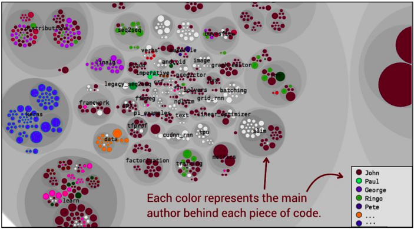

Você também tem que ter certeza que as pessoas que trabalham em diferentes times, mas relacionados, conhecem um ao outro em nível pessoal.

## Capítulo 8: Em direção a monolitos modulares através da visão social de código

### Desvie a bala de prata

Independente das decisões arquiteturais que fazemos, elas provavelmente serão invalidadas com o tempo, simplessmente porque uma organização não é estática.

Muitas organizações respondem a situaçõoes parecidas lançando um projeto para desenvolver um novo sistema com uma arquitetura que é melhor adaptada para as necessidades de hoje. Isso coloca a organização em uma posição difícil, já que vai encontrar um conjunto de possíveis problemas:
- Códiigo legado imediato: o sistema atual é aquele em uso, então precisa continuar a evoluir e ser mantido. O sinal que envia é que esforços de refatoração são desperdiçados a partir do momento em que uma base de código será substituída;
- O novo sistema vai ter que recuperar as funcionalidades continuamente implementadas como uma resposta do feedback do usuário no sistema antigo, que transforma o projeto em um alvo em movimento e implica necessidades de coordenação entre projetos forte;
- Divisão de esforços: ficar preso mantendo uma aplicação legado enquanto seus colegas trabalham no seu projeto futuro não é particularmente motivadora.
Nós substituímos a verdadeira complexidade do sistema que estamos tentando substituir.

Uma vantagem de criar um sistema de substituição é que ele te dá a oportunidade de reviisitar a funcionalidade existente definida e limpar as funcionalidades que se tornaram obsoletas.

Ainda precisamos investir esforços para melhorar nosso código existente. Vai viver por mais do que esperamos. O primeiro passo na direção de tais melhorias é obter atenção situacional: quão bem nossa arquitetura atual suporta a forma que nosso sistema cresce? Nosso próprio sistea não começa do zero, já que sua experiência te permite formar um conjunto de hipóteses em torno do que funciona e o que não funciona, e dali você junta dados para te guiar para mudanças futuras.

### Arquiteturas em camadas e o custo de consistência

A premissa básica de cada arquitetura em camadas é a separação de responsabilidades - por exemplo, as views não sabem nada sobre a base de dados e a lógica da aplicação é desacoplada dos detalhes da apresentação. Pelo menos, na teoria. Na realidade, um mundo em camadas tende a ser menos amigável.

Nenhuma funcionalidade é igual, e a maior parte das bases de código em camadas se beneficiariam ao reconhecer isso e tornar a maioria do códiigo expressado em um formato mais simples e menos estruturado. Vamos explorar algumas tentativas.

### Descubra contextos limitados através de padrões de mudança

Já que uma análise de mudança acoplada destaca os padrões de mudança dos desenvolvedores trabalhando no código, podemos usar a informação resultante para sugerir contextos limitados.
O padrão DDD é melhor apreciado quando você experimentou o oposto com um modelo compartilhado para a aplicação inteira.

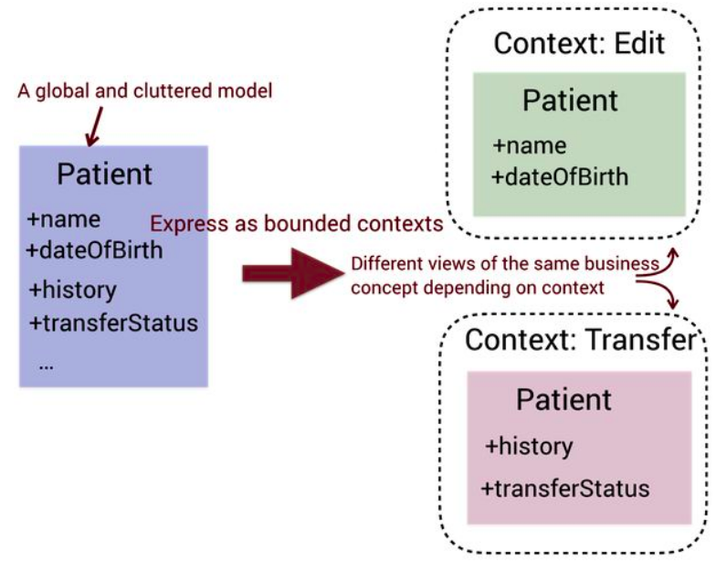

Desenvolver modelos específicos por contexto requer expertise no domínio, mas você pode usar técnicas gerais de análise social de código para descobrir o que é melhor expressar em contextos limitados e seguir suas refatorações baseados nessa informação.

### Procure por clusters de arquivos alterados em conjunto

Para descobrir candidatos para contextos limitados executamos uma análise a nível de arquivo onde procuramos por clusters de mudanças em conjunto e conectar arquivos logicamente relacionados.

Começamos explorando o acoplamento entre esses arquivos alterados no passado.

A análise de código social - como qualquer outro conjunto de ferramentas - não vai tomar as decisões por você, mas as técnicas te ajudam a estar no caminho certo ao apontar oportunidades que de outra forma são facilmente perdidas junto dos grupos de código no decorrer de módulos diferentes. As técnicas estão aqui para complementar sua expertise, não substitui-la. A chave é conhecer seu próprio domínio e ter certeza que sua arquitetura reflete.

Compartilhar código entre contextos limitados é uma péssima ideia.

A consequência é que a organização tinha 12 diferentes times que precisavam trabalhar em todos esses componentes, e o código ficava mudando em paralelo em uma taxa alta conforme cada equipe extendia os componentes existentes para construir funcionalidades diferentes. Muito tempo foi perdido em reuniões e merges de branches diferentes, o que levou a conflitos entre código e equipes.
Os custos organizacionais foram diretos no sentido de necessidades de coordenação efetivas, mas também indireto porque previne sinergias entre features diferentes, que em compensação significam oportunidades perdidas para simplificar o domínio da solução.

### Crie mapas de conhecimento da equipe

Mapas de conhecimento da equipe são baseados na quantidade de código contribuída por cada time dentro do período de análise.

Git nos permite minar o número de linhas adicionadas e deletadas de código para cada arquivo modificado com sua opção `--numstat`.

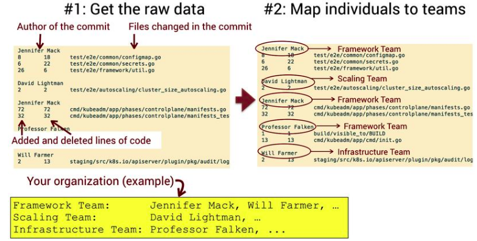

Usamos esses dados para operacionar nossa medida de conhecimento calculando uma porcentagem de código adicionada por cada equipe em todo arquivo, conforme mostrado na tabela a seguir.

| Arquivo | Equipe | Código contribuído |
| --- | --- | --- |
| common/configmap.go | Time de Framework | 87% |
| common/configmap.go | Time de Escala | 13% |
| ... | ... | ... |

Esse dado torna fácil identificar a equipe que escreveu a maior parte do código para caa arquivo, sabendo qual equipe tem o maior conhecimento naquela área.

### Nem todas as equipes são iguais

Existe uma falácia organizacional que é ter uma equipe separada para manutenção. Os perigos com essa abordagem é a que segue:
- Perda de motivação: baixa motivação é uma causa comum de perda de processo;
- Baixa coesão dentro do grupo: em uma equipe eficaz, os membros compartilham um objetivo e trabalham em tarefas relacionadas, que são aspectos que não são alcançáveis com uma equipe separada de manutenção, já que seu trabalho é reativo e se espalha em bug fixes sem relação;
- Iterações de feedback quebradas: cada bug representa uma oportunidade de aprendizado para o time de implementação, e se nunca revermos nosso caminho de defeitos e só resolver feature por feature e deixarmos os bugs dos nossos parceiros no outro time, nos colocamos fora desse loop de feedback valioso;
Muitas organizações notam os sintomas desses problemas e uma resposta comum é implementar um mecanismo guardião onde todo o código precisa ser revisado por uma pessoa designada, chamada de arquiteto.
Seu arquiteto guardião se torna um bloqueio global que limita a performance da organização. Além disso, a fadiga de revisão de código se torna real.

### Arquiteturas limpas e sujas

Uma arquitetura é boa quando suporta as alterações que queremos fazer no sistema e, conforme temos visto, ambos os tipos de alterações e a organização responsável por implementá-las provavelmente vão mudar com o tempo. Isso significa que sua arquitetura precisa evoluir e responder às circunstâncias mudando, que inevitavelmente significa retrabalhar os blocos construídos existentes.

## Capítulo 9: Sistemas de Sistemas - analizando diversos repositórios e microsserviços

Nota da Lauren: pode ser útil para mim, mas não nesse momento.

## Capítulo 10: Um membro extra na equipe: análises preditivas e proativas

Há uma crença comum na nossa indústria que dívida técnica acaba entrando na base de código com o tempo. No entanto, pesquisas recentes discordam e sugerem que esses code smells problemáticos são introduzidos na criação, e a futura evolução do código meramente continua a aprofundar o problema. Isso significa que precisamos de uma forma de obter possíveis problemas cedo, idealmente antes de entrarem na nossa branch principal.

### Quando o código fica ruim

Como fazer para lidar com 37 mil linhas de código cujas funções têm uma complexidade ciclomática bem além do ponto máximo? Pode ser que o código seja difíci lde lidar desde o começo.

Essa descoberta deveria impactar como vemos o código; é fácil achar que o código começa bem e degrada sobre o tempo.

É por isso que recomendo fazer essa caminhada inicial do código o quanto antes. Ao invés de esperar a feature ser completada, tornar isso uma prática para apresentar e discutir cada implementação a um terço de se completar. Foque menos nos detalhes e mais na estrutura geral, dependências, e quão bem o design se alinha com o domínio do problema.

Felizmente, a análise do comportamento do código pode nos ajudar a detectar tais códigos antes de ser mergeado na branch master.

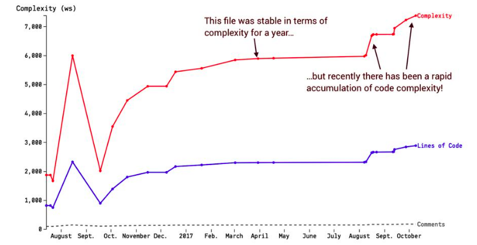

Um bom começo é olhar para a diferença do seu último commit.
1. Use o commit da branch como ponto de referência;
2. Use um período de tempo.

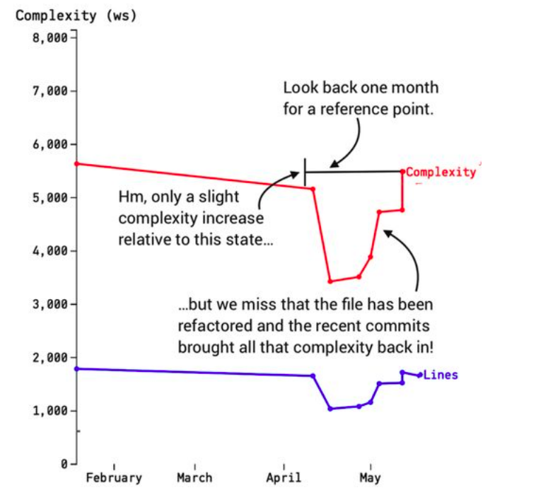

Quando você investiga avisos de tendências de complexidade, é possível que você depare com os cenários a seguir:
- Comportamento colocado no lugar errado: crescimento rápido de complexidade é um sinal que o código continua acumulando responsabilidade;
- Excesso de lógica condicional: geralmente novas funcionalidades ou bug fixes são inseridos dentro de um design existente com o uso de if/else. Mais condicionais aninhadas indicam uma abstração faltando, e refatorar o código para usar polimorfismo ou list comprehensions, ou até modelar o dado como sequência, apaga casos especiais do código;
- O código está bem: sim, acontece, e nesse caso podemos ignorar o aviso.

### Detecte futuros hotspots

Quando código ruim é introduzido, é possível que em breve ele irá requerir diversas modificações para diminuir seus efeitos, ou vai continuar atraindo mais commits porque o código tem responsabilidades demais. Isso mostra uma mudança no foco do desenvolvimento.
Podemos detectar esse código procurando por arquivos que escalam rapidamente o ranking de hotspots - isso é, hotspots em ascensão. Para detectar hotsposts em ascensão fazemos dois cálculos:
- Uma análise de hotspot baseada em como o código está agora;
- Outra análise de hotspot baseada em como o código parecia no passado.

```bash
git log --before="two months ago" --format=format: --name-only | egrep -v '^$' | sort | uniq -c | sort -r > <arquivo>.txt
```

Depois, geramos mais um arquivo com o ranking do hotspot atual, simplesmente omitindo a opção `--before`, e redirecionamos a saída para outro arquivo.

Essa descoberta levanta um ponto importante: só porque alguns arquivos começam a atrair muitos commits, não quer dizer que o código é um problema. Ao invés disso, isso significa que os esforços de desenvolvimento são investidos em uma parte nova da base de código. Isso é informação que podemos usar para direcionar nossa atenção no formato de revisão de código, dando uma olhada no código, ou uma conversa amigável com os desenvolvedores por trás disso. Nossa tarefa é confirmar o que esperamos: está tudo bem com o código. Se esse não for o caso, precisamos investir refatorações imediatas para evitar futuros problemas de manutenção.

### Identifique os experts

O mapa de conhecimento representa o principal desenvolvedor por trás de cada arquivo com uma cor única. O desenvolvedor principal é medido como a pessoa que escreveu a maior parte do código, logo sendo a pessoa com mais conhecimento sobre sua área de aplicação.

A vantagem do mapa de conhecimento é te permitir detectar grupos de código escritos pelo mesmo autor, tornando fácil identificar o verdadeiro expert do domínio em uma área de aplicação em particular.

### Medida da medida de conhecimento futuro

Já que o controle de versão sabe qual desenvolvedor escreveu cada pedaço de código, precisamos usar essa informação para estimar o impacto se um desenvolvedor deixa a empresa ou é transferido para outro projeto.

Introduzimos equipes virtuais porque é uma solução mais geral que funciona mesmo quando temos grupos de desenvolvedores, como um time inteiro que trabalhou junto - talvez em mob programming. O mesmo algoritmo funciona quando um único desenvolvedor que parte, também.

### Reaja à perda de conhecimento

Quando um desenvolvedor vai sair da empresa, execute essa análise para identificar as partes do sistema onde sua organização precisa focar para manter o conhecimento.

É claro que você deve encontrar mais alguém que entenda do código bem o suficiente mesmo que não tenham escrito. Se não, você precisa usar os dados da perda de conhecimento para lidar com o dano, e outras análises de comportamento podem ajudar:
- Hotspots: te ajuda a identificar partes críticas do código onde possíveis perdas de conhecimento são mais severas;
- Idade do código: se um pedaço bandonado não foi tocado em um tempo, essa parte é menos crítica que outras;

### Conheça os vieses e workarouns para análise comportamental de código

No geral, cerca de 150 a 200 commits são suficientes para uma análise inicial.
Quando você tem um sistema existente, falsos positivos envieram os dados já que hotspots são uma medida relativa. Falsos positivos também tornam a informação mais difícil de interpretar. Isso significa que você precisa limpar seus dados removendo código gerado automaticamente e artefatos que não são código que não são interessantes para a sua análise.
Evite as armadilhas:
- Informação incorreta do autor: um commit no Git sempre vai estar associado a um autor, mas pode não ser o autor de verdade. Pode vir migrado de outro repositório;
- Repositórios copia e cola: um viés relcaionado quando uma organização decide extrair um componente em um repositório GIt separado mas falha em migrar seu histórico;
- Squash de commits utilizados incorretamente: o squash é útil para uma escala pequena, mas é desastroso quando aplicadas a trabalho commitado por diversos indivíduos. O histórico gerado apaga tanto a informação socail quanto os dados acoplados.

### Seu código ainda é uma cena do crime

A psicologia forense moderna evoluiu para usar estatísticas matemáticas como ferramenta de suportar ações e decisões. E aqui a indústria de software tem muito a aprender, já que muitas decisões técnicas e organizacionais são baseadas em impressões pessoais.
O código comportamental não te oferece nenhuma bala de prata, nem tem a intenção de substituir nada. Ao invés disso, as análises estão aqui para complementar sua expertise existente focando sua atenção nas partes do sistema que mais precisam dela. O objetivo máximo é escrever software melhor que é capaz de evoluir com a pressão de funcionalidades novas, usos e circunstâncias organizacionais alteradas. Escrever código de qualidade nunca será fácil, já que o desenvolvimento de software é uma das coisas mais difíceis que nós humanos podemos fazer.