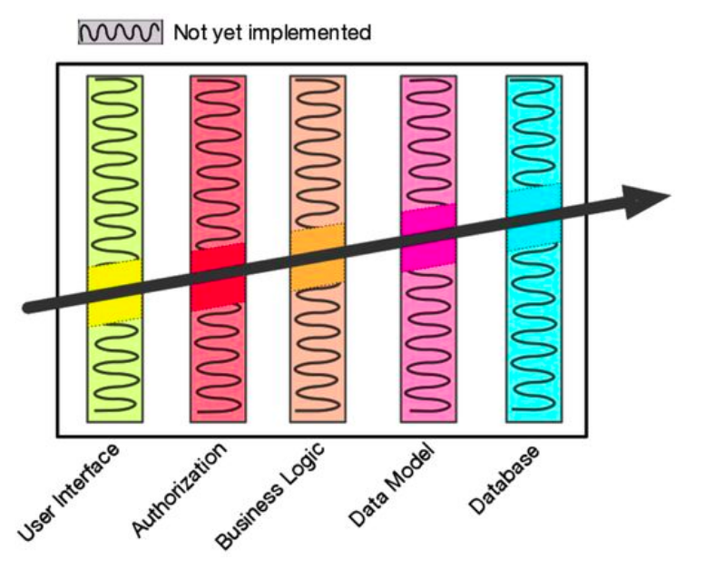
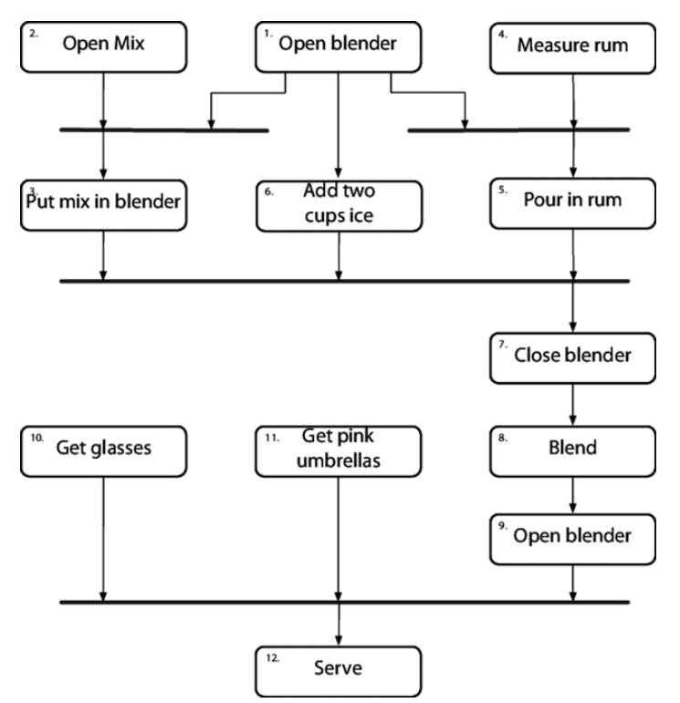
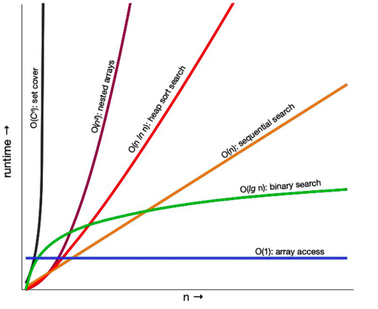

# The Pragmatic Programmer

## 1. Prefácio

A programação é sobre tornar o futuro menos doloroso.

## 2. Prefácio da segunda edição

N/A

### 1. Como o livro é organizado

N/A

### 2. O que há em um nome?

N/A

### 3. Código fonte e outros recursos

N/A

### 4. Nos envie feedback

N/A

### 5. Reconhecimentos da segunda edição

N/A

## 3. Do prefácio para a primeira edição

H/A

### 1. Quem deveria ler esse livro?

N/A

### 2. O que torna um programador pragmático?

- Adoção rápida
- Inquisição
- Pensamento crítico
- Realismo
- Quebra-galho

### 3. Pragmatismos individuais, times grandes

### 4. É um processo contínuo

## I. Uma filosofia pragmática

### 1. É a sua vida

### 2. O gato comeu meu código fonte

Quando você realmente aceita a responsabilidade por um resultado, deve esperar ser capaz de lidar com isso. Quando você comete um erro (como todos nós fazemos) ou um erro no julgamento, admita honestamente e tente oferecer opções.

Antes de você se aproximar de alguém para dizer por que algo não deve ser feito, está tarde, ou está quebrado, pare e ouça a si mesmo. Fale com o patinho de borracha no seu monitor, ou com o gato. Sua desculpa parece fazer sentido ou é estúpida? Como ela vai soar para o seu chefe?

### 3. Entropia de software

Quando a desordem aumenta no software, chamamos de "podridão de software". Algumas pessoas chamam por um termo mais otimista: "dívida técnica", com a noção implícita de que vão pagar de volta algum dia. Provavelmente não vão.

Qual a diferença entre uma cidade super limpa e uma cidade suja?
Uma janela quebrada.

Ignorar uma situação clara de janela quebrada reforça a ideia de que talvez nada possa ser corrigido, que ninguém se importa, que tudo está perdido; todos os pensamentos negativos podem se espalhar entre os membros da equipe, criando uma espiral viciosa.

Não deixe "janelas quebradas" (designs ruins, decisões erradas, ou código pobre) não-reparadas. Corrija cada uma assim que descobri-la.

Uma janela quebrada - um pedaço de código mal planejado, uma decisão de gestão ruim que o time pode ter que viver com a duração do projeto - é tudo o que é necessário para começar a piorar.

### 4. Sopa de pedra e sapos cozidos

Quando quiser que as pessoas façam algo por você, pense no que você pode pedir de forma razoável. Desenvolva esse pedido bem. Quando conseguir, mostre às pessoas, deie-as discutir. Depois diga "é claro que seria melhor se adicionássemos tal coisa" como se não fosse importante. Sente-se e espere-os começarem a te pedir para adicionar a funcionalidade que você queria originalmente. As pessoas vão achar mais fácil se juntar a um sucesso em progresso. Mostre-os um vislumbre do futuro e você vai contar com apoio.

Preste atenção ao que está acontecendo ao redor de você, não apenas ao que você está fazendo.

### 5. Software bom o suficiente

Muitos usuários iriam preferir usar o software com algumas falhas hoje do que esperar um ano pela versão perfeita.

Se puder fazer com que seus usuários usem a aplicação cedo, o feedback vai levar a uma solução melhor em algum ponto.

### 6. Seu portfólio de conhecimento

Sua habilidade de aprender coisas novas é seu componente estratégico mais importante.

Criando seu portfólio:
- Invista regularmente
- Diversifique
- Lide com os riscos
- Compre baixo, venda alto
- Revise e reequilibre

Sugestões de objetivos:
- Aprenda pelo menos uma linguagem todo ano
- Leia um livro técnico por mês
- Também leia livros não-técnicos
- Participe de aulas
- Participe de grupos locais de usuários e meetups
- Experimente com ambientes diferentes
- Se atualize

Um truque de consultoria favorito: se pergunte "por quê?" pelo menos cinco vezes. Faça uma pergunta, dê uma resposta. Se aprofunde perguntando "por quê?" repetidamente como se fosse uma criança de quatro anos curiosa. Você deve ser capaz de chegar perto da causa raiz dessa forma.

Se pergunte do contexto. Quais são os pré-requisitos, quais são as consequências a curto e longo prazo? Sob quais circunstâncias? Está tarde demais? Cedo demais? Não pare no pensamento mais próximo, mas use o pensamento que vem depois: o que vai acontecer depois disso?

Por que isso é um problema? Há algum modelo subjacente? Como ele funciona?

### 7. Comunique-se!

Você está se comunicando só se estiver passando a informação que quer passar - só falar não é suficiente. Para fazer isso, você precisa entender as necessidades, interesses e capacidades dos seus ouvintes.

Como todas as formas de comunicação, o truque aqui é coletar feedback. Não apenas espera perguntas: peça por elas.

Planeje o que quer dizer. Escreva um resumo. Depois se pergunte: "isso comunica o que eu quero expressar para o meu público de forma que funciona para eles?". Refina até que funcione.

Quando você se deparar com uma reunião importante ou uma conversa com um cliente importante, rascunhe as ideias que quer comunicar e planeje algumas estratégias para passar por elas.

Faça com que você está dizendo seja um momento relevante, assim como seu conteúdo. Às vezes tudo o que é necessário é a pergunta simples: "essa é uma boa hora para falar disso?".

Ajuste o estilo da sua entrega para combinar com sua audiência.

Envolva seus leitores com rascunhos prévios do seu documento. Obtenha o feedback deles, cutuque seus cérebros. Você vai construir uma relação boa e provavelmente vai produzir um documento melhor no processo.

Há uma técnica que você deve usar caso queira que as pessoas te escutem: escute a elas.

Restrinja seus comentários fora da API para discutir por que algo é feito, seu propósito e sua meta.

## II. Uma abordagem pragmática

### 8. A essência do bom design

Uma coisa tem um bom design caso se adapte às pessoas que a utilizam. Para o código, isso significa estar apto à mudança. Logo, a creditamos no princípio ETC: Easier to Change (Mais Fácil para Mudar). ETC. É isso.

Por que desacoplamento é tão bom? Porque as preocupações isoladas tornam as coisas mais fáceis de mudar. ETC.
Por que o princípio de responsabilidade única (SRP) é útil? Porque uma mudança nos requerimentos é espelhada por uma mudança em apenas um módulo. ETC.
Por que nomes são importantes? Porque bons nomes tornam o código mais fácil de ler, e você precisa ler o código para mudá-lo. ETC!

Tente fazer o que você escreve substituível.

### 9. DRY - O mal da duplicação

Todo pedaço de conhecimento deve ter uma representação simples, não-ambígua e autoritária dentro de um sistema.

Se você mudar uma coisa, tem que lembrar de mudar as outras ou, como computadores alienígenas, seu programa pode acabar com você por conta de contradições. A questão não é se você vai lembrar: é quando você vai esquecer.

DRY (não se repita) fala sobre a duplicação de conhecimento, de intenção. É sobre expressar a mesma coisa em dois lugares diferentes, possivelmente em duas formas totalmente diferentes.

Quando utilizamos códigos parecidos, mas para propósitos diferentes, há a dúvida se há uma violação do DRY. Mas eles estão errados. O código é o mesmo, mas o conhecimento que representam é diferente. As duas funções validam duas coisas diferentes que só coincidentemente têm as mesmas regras.
Essa é uma coincidência, não uma duplicação.

Se pergunta o que o comentário agrega ao código antes de adicioná-lo.

Quando você faz um módulo que expõe uma estrutura de dados, você está acoplando todo o código que usa essa estrutura para a implementação daquele módulo.

### 10. Ortogonalidade

Duas linhas são ortogonais se eles contém o mesmo ângulo em eixos diferentes. Em termos de vetores, as duas linhas são independentes.

Duas ou mais coisas são ortogonais se a mudança em uma não afetar nenhuma das outras.

De repente você está lidando com um sistema inacreditavelmente complexo, onde toda mudança impacta todas as outras entradas. Seu peso de trabalho é fenomenal: suas mãos e pés estão constantemente se movendo, tentando equilibrar todas as forças se interagindo.

Você obtém dois principais benefícios se criar sistemas ortogonais: aumento de produtividade e risco reduzido.

Ganho de produtividade
- Mudanças estão em apenas um local, então o tempo de desenvolvimento e tempo de teste são reduzidos. É mais fácil escrever componentes pequenos e contigos ao invés de um bloco único de código. Componentes simples podem ser desenvolvidos, codificados, testados e então esquecidos - não há necessidade de continuar mudando código existente enquanto você adiciona código novo.
- Uma abordagem ortogonal também promove o reuso. Se componentes têm responsabilidades específicos e bem definidas, elas podem ser combinadas com novos componentes de forma a não serem previstas pelos seus implementadores originais. Quanto mais fracamente acoplados seus sistemas, o mais fácil eles são para reconfigurar e reescrever.
- Há um ganho sutil de produtividade quando você combina componentes ortogonais. Presuma que um componente faz M coisas diferentes e outro faz N. Se eles são ortogonais e você os combina, o resultado são coisas M x N. No entanto, se os dois componentes não são ortogonais, eles vão ficar um em cima do outro e o resultado vai ser pior. Você obtém mais funcionalidade por unidade de efeito combinando componentes ortogonais.

Redução de risco:
- Sessões de código ruins são isoladas. Se um módulo tem qualidade ruim, é menos provável que ele espalhe os sintomas para o resto do sistema. Também é mais fácil removê-lo e substitui-lo por algo novo e saudável.
- O sistema resultante é menos frágil. Faça mudanças pequenas e correções para uma área específica, e qualquer problema que você gerar será restrito àquela área.
- Um sistema ortogonal provavelmente será melhor testado, porque será mais fácil desenvolver e executar os testes em seus componentes.
- Você não está dependente de um vendor, produto ou plataforma em específico, porque as interfaces desses produtos externos serão isoladas nas partes menores do desenvolvimento geral.

Às vezes esses componentes são organizados em camadas, cada uma provendo um nível de abstração. Essa abordagem de camadas é uma forma poderosa de desenvolver sistemas ortogonais. Porque cada camada usa apenas as abstrações providas das camadas abaixo dela e você tem grande flexibilidade em mudar implementações relacionadas sem afetar o código. Camadas também reduzem o risco de dependências escaparem entre os módulos.

Há uma forma facil de testar um design ortogonal. Quando você mapear seus componentes, se pergunte: se eu mudar drasticamente os requerimentos por trás de uma função em particular, quantos modelos são afetados? Em um sistema ortogonal, a resposta será "uma".

Se um esquema de objeto persistido é transparente, então ele é ortogonal. Se ele requisitar que você crie ou acesse objetos de forma específica, então não é. Manter esses detalhes isolados do seu código tem o benefício de torná-los mais fáceis de mudar no futuro.

Mantenha seu código desacoplado: crie módulos que não revelem nada desnecessário para outros módulos e que não dependem de implementações de outros módulos.

Evite dados globais: sempre que seu código referenciar um dado global, ele se anexa a outros componentes que compartilham esse dado.

Às vezes você vai encontrar um conjunto de funções que parecem similares - talvez eles compartilhem código em comum no começo e no final, mas cada um tem um algoritmo central diferente. Duplicação de código é sinal de problemas estruturais. Dê uma olhada no padrão Strategy para uma implementação melhor.

Um sistema ortogonalmente planejado e implementado é mais fácil de ser testado. Boa parte dos testes do sistema podem ser performados a nível de módulo invidivual. Essas são boas notícias, porque o teste  a nível de módulo (ou unidade) é consideravelmente mais fácil de especificar e performar que teste de integração.

Quando você faz uma mudança, ela corrige tudo, ou outros problemas aparecem misteriosamente?

Com documentação verdadeiramente ortogonal, você deve ser capaz de mudar a aparência drasticamente sem mudar o conteúdo.

### 11. Reversibilidade

O problema é que decisões críticas são dificilmente reversíveis.

Requerimentos, usuários e hardware mudam mais rápido do que podemos desenvolver software.

Enquanto várias pessoas tentam manter seu código flexível, você também precisa pensar sobre manter flexibilidade nas áreas de arquitetura, publicação e integração com vendor.

### 12. Balas de trajetória

Balas de trajetória são carregadas em intervalos juntos da munição normal. Quando são atiradas, seu fósforo inflama e deixa uma trilha pirotécnica da arma para seja lá o que acerta. Se as balas estão atingindo o alvo, as balas normais também estão. Soldados usam essas balas para refinar sua pontaria: é pragmática e dá feedback em tempo real sob condições atuais.

Usamos o termo de desenvolvimento de balas de trajetória para visualmente ilustrar a necessidade de feedback imediato sob condições atuais com um alvo em movimento.

Você está usando algoritmos, técnicas, linguagens ou bibliotecas que não tem faciliaridade e enfrenta vários desconhecidos. E já que projetos levam um tempo para serem completados, você pode muito bem garantir o ambiente que está trabalhando mesmo que ele mude quando você tiver terminado.

Procure por requerimentos importantes, aqueles que definem o sistema. Procure por áreas onde você tem dúvidas e onde você vê maiores riscos. Depois, priorize seu desenvolvimento para que essas sejam as primeiras áreas que você codifica.

Imagine uma arquitetura com cinco camadas arquiteturais. Temos algumas dúvidas sobre como elas se integram, então procuramos por uma funcionalidade simples que nos permite usá-las juntas. A linha em diagonal mostra o caminho que a funcionalidade leva percorrendo o código. Para fazê-la funcionar, temos que implementar as áreas destacadas em cada camada: o restante pode ser feito depois.



O código de trajetória não é descartável: você escreve para mantê-lo. Ele contém toda a verificação de erro, estruturação, documentação e verificação que qualquer peça de código de produção tem. Só não é totalmente funcional.

E tem algumas vantagens:
- Usuários conseguem ver algo funcionando cedo
- Desenvolvedores criam uma estrutura para trabalharem em cima
- Você tem uma plataforma de integração
- Você tem algo para demonstrar
- Você tem uma noção melhor de progresso

Você usa essa técnica em situações onde não tem 100% de certeza de onde está indo.

Então mude o que você precisa trazer para mais próximo do alvo, e sinta-se bem port er usado uma metodologia do lean development; um corpo pequeno de código que tem pouca inércia - é fácil e rápido de mudar. Você vai ser capaz de coletar feedback na sua aplicação e gerar uma versão nova e mais precisa rapidamente e de forma mais barata. E porque todo componente principal da aplicação está representado no seu código de trajetória, seus usuários têm confiança que o que eles estão vendo está baseado na realidade, não apenas em especificação do papel.

Com um protótipo, você está planejando explorar aspectos específicos do sistema final. Com um protótipo verdadeiro, você vai jogar fora o que tiver desenvolvido no conceito e refazer apropriadamente usando as lições que você aprendeu.

O framework permanece intacto e você sabe que o sistema vai continuar a se comportar da mesma forma que você fez o código de trajetória funcionar.

O protótipo gera código descartável. O código de trajetória é simples, mas não completo, e forma parte do esqueleto do sistema final.

### 13. Protótipos e notas de post-it

Contruímos protótipos de software da mesma forma e pelas mesmas razões - para analisar e expôr risco, e para oferecer chances para correção com custo muito menor.

Você pode prototipar:
- Arquitetura
- Nova funcionalidade de um sistema existente
- Estrutura ou conteúdos de dados externos
- Ferramentas terceiras ou componentes
- Problemas de performance
- Design de interface de usuário

Quando cria um protótipo, que detalhes você quer ignorar?
- Correção
- Perfeição
- Robustez
- Estilo

Existem algumas áreas específicas para ter atenção no protótipo arquitetural:
- As responsabilidades das principais áreas estão bem definidas e apropriadas?
- As colaborações entre os principais componentes estão bem definidas?
- O acoplamento está minimizado?
- Você consegue identificar possíveis fontes de duplicação?
- As definições de interface e restrições são aceitáveis?
- Cada módulo tem um caminho de acesso aos dados que necessita durante a execução? Eles têm o acesso quando precisam dele?

### 14. Linguagens de domínio

A linguagem de domínio que você cria é mais poderosa e esse poder vem de graça.

O ponto negativo de linguagens de domínio interno é que estamos atrelados à sintaxe e semântica daquela linguagem.

### 15. Estimar

Recomendamos que você escale o tempo da seguinte forma:

| ------- | --------- |
| Duração | Estime em |
| ------- | --------- |
| 1-15 dias | Dias |
| 3-6 semanas | Semanas |
| 8-20 semanas | Meses |
| 20+ semanas | Pense bem antes de dar uma estimativa |
| ------- | --------- |

Um truque básico de estimativa que sempre vai te dar boas respostas: pergunte para alguém que já fez aquilo.

DO seu entendoimento da questão a ser perguntada, crie um esqueleto de modelo mental mal feito.

Quando tiver um modelo, divida-o em componentes. Você vai precisar descobrir as regras matemáticas que descrevem como esses componentes interagem.

Quando o Exército Marítimo estadunidente precisou planejar o projecto do submarino Polaris, eles adotaram esse estilo de estimativa com uma metodologia que chamaram de Técnica de Revisão de Avaliação de Programa, ou PERT.
Toda tarefa PERT tem uma estimativa otimista, mais provável e pessimista. As tarefas são organizadas em uma rede de dependência, e então você usa estatísticas simples para identificar as melhores e piores estimativas para o geral do projeto.

É possível definir estimativas melhores para um projeto ao repetidamente:
- Verificar requerimentos
- Analisar o risco (e priorizar os itens mais arriscados)
- Desenvolver, implementar, integrar
- Validar com os usuários
Inicialmente, você tem só uma vaga ideia de quantas iterações serão necessárias, ou quanto tempo eles vão levar.
Logo, você completa a codificação e teste da funcionalidade inicial e marca essa como o final da primeira iteração e vai refinando. Esse tipo de estimativa geralmente é feito durante a revisão do filme no final de cada ciclo iterativo.

## III. As ferramentas básicas

### 16. O poder do texto plano

O texto plano é feito de caracteres imprimíveis de forma a transmitir informação.

Gostamos quando nossos textos planos são compreensíveis para humanos.

O texto plano não é sinônimo de texto não-estruturado; HTML, JSON, YAML etc são textos planos. Assim como a maioria dos protocolos fundamentais de conexão, como HTTP, SMTP, IMAP e por aí vai. E isso é feito por bons motivos:
- Segurança ao invés de obsolescência
- Melhoria de ferramentas existentes
- Testes mais fáceis

### 17. Jogos de shell

N/A

### 18. Editor de poder

N/A

### 19. Controle de versão

N/A

### 20. Debugging

Na árena técnica, você quer se concentrar para corrigir o problema, não encontrar de quem foi a culpa.
Não importa qual seja o bug e se a culpa é sua ou de outra pessoa. ELe ainda é um problema.

Tenha cuidado com a miopia quando for debuggar. Resista à vontade de corrigir apenas os sintomas que você vê: é mais provável que o verdadeiro motivo esteja a vários passos do que você está observando e pode envolver um número de outras coisas relacionadas. Sempre tente descobrir a causa raiz de um problema, não apenas a aparência atual dele.

Antes de começar a investigar o bug, tenha certeza de que você está trabalhando em código limpo - sem avisos.

Quando tentar resolver qualquer problema, colete todos os dados relevantes possíveis.

A precisão no relatório de bug é menor quando ele vem de aplicativos externos - você pode precisar acompanhar o usuário que reportou o bug em ação para obter nível de detalhe o suficiente.

Você pode precisar entrevistar o usuário que reportou o bug para obter mais dados do que os iniciais.

Testes artificiais não exercitam o suficiente. Você deve testar ambas as condições extremas e realistas da aplicação de forma sistemática.

Quando achar que sabe o que está acontecendo, é hora de descobrir o que o programa acha que está acontecendo.

A melhor forma de começar a corrigir um bug é tentar reproduzi-lo. Afinal de contas, se não puder reproduzi-lo, como saber se foi corrigido?

Outras formas são:
- Logging/tracing
- Rubber ducking
- Processo de eliminação

Quando se deparar com um bug surpresa, ao invés de apenas corrigi-lo, tente determinar por que essa falha não foi capturada mais cedo. Considere se você precisa adicionar a unidade ou outros testes para que eles tenham capturado.

Se o bug é o resultado da suposição incorreta de alguém, discuta o problema com o time inteiro: se uma pessoa não entendeu, é possível que mais pessoas não tenham entendido o mesmo.

Checklist de debug:
- O problema a ser reportado é resultado direto de um bug subjacente ou é apenas um sintoma?
- O bug está realmente na framework que vocês estão usando? Ele está no sistema operacional? Ou apenas está no seu código?
- Se você explicar esse problema em detalhe para um colega de trabalha, o que a pessoa diria?
- Se o código suspeito passa nos testes de unidade, os testes estão completos o suficiente? O que acontece se você executar os testes com outros dados?
- As condições que causaram esse bug existem em outro lugar do sistema? Existem outros bugs na fase larva, esperando para aparecerem?

### 21. Manipulação de texto

N/A

### 22. Diários de engenharia

Um diário de engenharia é um tipo de diário em que você coloca o que fez, coisas que aprenderam, rascunhos de ideias, leituras de medidores: basicamente qualquer coisa que tenha relação com o trabalho. Quando o caderno fica cheio, escreve-se as datas em uma espiral e a coloca na estante próximo aos outros diários.

Ele tem três principais benefícios:
- É mais confiável que a memória
- Te dá um lugar para armazenar ideias que não são imediatamente relevantes à tarefa atual
- Age como um tipo de patinho de borracha

## IV. Paranoia pragmática

Ao saber que ninguém escreve código perfeito, inclusive nós mesmos, os Programadores Pragméticos criam defesas contra seus próprios erros.

### 23. Design por contrato

É uma técnica simples porém poderosa que foca em documentar os direitos e responsabilidades de módulos de software para certificar que o programa funciona corretamente. O que é um programa correto? Um que faz nada mal nada menos o que deve fazer. Documentar e verificar essa definição é o principal do Design por Contrato (DBC).

As expectativas e definições são as seguintes:
- Pré condições: o que precisa ser verdade para a rotina ser chamada
- Pós condições: o que a rotina precisa fazer; o estado do mundo onde a rotina é feita
- Invariantes de classe: uma classe garante que essa condição seja sempre verdade da perspectiva de quem a chama

Se todas as pré condições da rotina batem para quem a chama, a rotina deve garantir que as pós condições e invariantes sejam verdadeiras quando é completada.

Seja lá o que aconteça, qualquer falha que aconteça ao contrato é um bug.

Seja estrito com o que aceita antes de começar e prometa o menos possível em retorno.

O TDD é uma técnica ótima, mas assim como várias técnicas, pode te convidar a se concentrar apenas no "caminho feliz" e não no mundo real repleto de dados ruins, atores ruins, versões ruins e especificações ruins.

Para implementar o DBC, basta enumerar qual o alcance da entrada de domínio, definir as condições de limite e o que a rotina promete entregar - ou, mais importante ainda, o que ela não promete entregar.

O DBC combina bastante com nosso conceito de quebrar o quanto antes.

### 24. Programas mortos não mentem

Um dos benefícios de detectar problemas o quanto antes é que você pode quebrar o sistema antes, e quebrar é a melhor coisa que você pode fazer.

Seu código descobre que algo que era impossível de acontecer acabou de acontecer, e seu programa não é mais viável. Qualquer coisa a partir daquele ponto se torna suspeito, então finalize o quanto antes.

### 25. Programação assertiva

Sempre que se pegar pensando "mas é claro que isso nunca aconteceria", adicione um código para verificar.

### 26. Como equilibrar recursos

N/A

### 27. Não corra mais que seus farois

O que queremos dizer com feedback? Qualquer coisa que comprove sua ação. Por exemplo:
- Resultados em um REPL dão feedback ao seu conhecimento de APIs e algoritmos
- Testes de unidade dão feedback sobre sua mais recente mudança de código
- Demonstração de usuário e conversação dão feedback de funcionalidades e usabilidade

Você pode se encontrar contando com a sorte quando tiver que:
- Estimar quando algo ficará pronto no futuro
- Planejar um design para futura manutenção ou extensão
- Adivinhar as necessidades do futuro dos usuários
- Adivinhar a disponibilidade de tecnologia no futuro
No entanto, os designs não são feitos para serem mantidos no futuro? Sim, mas até certo ponto: apenas o mais longe que você puder enxergar.

## V. Dobre ou quebre

### 28. Desacoplamento

O acoplamento é o inimigo da mudança, porque conecta coisas que devem ser alteradas em paralelo. Isso torna a mudança mais difícil: ao invés de perder tempo descobrindo todas as partes que precisa de mudança, você perde tempo se perguntando por que as coisas quebram quando você muda "só uma coisa" e não as coisas que estavam acopladas.

Para serem flexíveis, componentes individuais devem ser acoplados à menor quantidade de componentes possível.

E, para tornar as coisas ainda piores, o acoplamento é transitivo: se A estiver acoplado a B e C, e B estiver acoplado a M e N, e C à X  e Y, então A está acoplado a B, C, M, N, X e Y.

Fique de olho nos seguintes sintomas do acoplamento:

- Dependências malucas entre módulosou bibliotecas não relacionadas
- Mudanças "simples" em um módulo que propaga para módulos não relacionados no sistema ou quebram coisas em outro lugar
- Desenvolvedores que têm medo de mudar código porque não têm certeza do que pode ser afetado
- Reuniões onde todos têm que participar porque ninguém tem certeza de quem será afetado por uma alteração

Diga, não pergunte: esse princípio diz que você não deveria fazer decisões baseadas no estado interno de um objeto para então atualizar o objeto. Fazer isso destrói totalmente os benefícios de encapsulamento e, ao fazer isso, espalha conhecimento da implementação pelo código.

A lei de deméter é um conjunto de guidelines escritas nos anos 80. A intenção é ajudar desenvolvedores do Projeto Demeter a manter suas funções mais limpas e desacopladas.
A LoD diz que um método definido em uma classe C deve apenas chamar:
- Outra instâncias de métodos de C
- Seus parâmetros
- Métodos de objetos que cria, ambos na pilha e no heap
- Variáveis globais

Tente não ter mais do que um "." quando acessar algo.

### 29. Julgando o mundo real

O padrão observer tem um problema: já que cada um dos observadores precisa se registrar com o observável, o acoplamento é inserido naturalmente. Além disso, a típica implementação os callbacks são resolvidos na mesma linha do observável de forma assíncrona, e isso pode gerar gargalos de performance.

O pubsub generaliza o padrão oserver enquanto resolve os problemas de acoplamento e performance.

### 30. Programação de transformação

N/A

### 31. Taxa de herança

Interfaces e protocolos nos dão polimorfismo sem herança.

Se uma classe pai tem 20 métodos e a subclasse quer usar apenas duas delas, seus objetos ainda vão ter outras 18 sem utilização. A classe perde controle de sua interface.

### 32. Configuração

Coisas comuns que você provavelmente vai querer colocar nos dados de configuração incluem:
- Credenciais para serviços externos (base de dados, APIs externas etc)
- Níveis de logging e destinos
- Porta, endereço de IP, máquina e nomes de clusters que o app use
- Parâmetros de validação específicas do ambiente
- Parâmetros definidos de forma externa, como valor de taxas
- Detalhes de formatação específicos
- Chaves de licensa

## VI. Concorrência

A concorrência é quando a execução de dois ou mais pedaços agem como se fossem executados ao mesmo tempo. Paralelismo é quando eles realmente são executados ao mesmo tempo.

Para ter concorrência, você precisa executar código em um ambiente que pode trocar a execução entre partes diferentes do seu código quando estiver sendo executado. Isso geralmente é implementado usando coisas como fibers, threads e processos.

Para ter paralelismo, você precisa que o hardware consiga fazer duas coisas de uma vez. Isso é possível com vários núcleos em uma CPU, várias CPUs em um computador ou vários computadores conectados juntos.

Tudo é concorrente.

A concorrência é um requerimento se você quiser que sua aplicação seja capaz de lidar com o mundo real, onde coisas são assíncronas: usuários interagindo, dados sendo obtidos, serviços externos sendo chamados, tudo ao mesmo tempo. Se você forçar esse processo a ser serial, com uma coisa acontecendo, depois outra, e aí por diante, seu sistema fica lerdo e você provavelmente não está tomando vantagem do poder do hardware em que ele é executado.

Por que escrever código concorrente e paralelo é tão difícil? Um motivo é que aprendemos a programar usando sistemas sequênciais, e nossas linguagens têm funcionalidades que são relativamente seguras quando usadas sequencialmente mas se torna um problema quando duas coisas acontecem ao mesmo tempo. Um dos maiores culpados aqui é um estado compartilhado. Isso não significa apenas variáveis globais: a qualquer momento em que dois ou mais pedaços de código contém referências ao mesmo pedaço de dado mutável, você tem um estado compartilhado.

### 33. Quebrando o acoplamento temporal

Estamos falando sobre o papel do tempo como um elemento de design do próprio software. Existem dois aspectos de tempo que são importantes para nós: concorrência (coisas acontecendo ao mesmo tempo) e ordenação (posições relativas das coisas no tempo).

É a forma que a maior parte das pessoas pensa - faça isso e depois faça aquilo. Mas pensar dessa forma leva ao acoplamento temporal: acoplamento ao tempo.

Preciamos descobrir o que pode acontecer ao mesmo tempo, e o que deve acontecer de forma estrita. Uma forma de fazer isso é capturar o workflow usando uma notação como o diagrama de atividade.

Um diagrama de atividade consiste de um conjunto de ações desenhadas como caixas redondas. A seta que parte de uma ação leva para outra ação (que pode começar quando a primeira ação é completada) ou para uma linha chamada barra de sincronização. Quando todas as ações levando para uma barra de sincronização estão completas, você pode prosseguir junto de outras flechas deixando a barra. Uma ação que não recebe setas pode ser iniciada a qualquer momento.

Para a produção de uma bebida:
1. Abrir o blender  
2. Abrir a mistura de piña colada 
3. Colocar mistura no blender 
4. Medir meio copo de rum
5. Misturar o ruim
6. Adicionar dois copos de gelo
7. Fechar o blender
8. Misturar por 1 minuto
9. Abrir o blender
10. Pegar copos
11. Pegar guarda-chuvas rosa
12. Servir



E é aqui que a parte do design aparece. Quando olhamos para as atividades, percebemos que o número 8, misturar, leva 1 minuto. Durante esse tempo, nosso bartender pode pegar os copos e os guarda-chuvas (10 e 11) e provavelmente ainda tem tempo de servir outro cliente.

Estamos esperando encontrar atividades que levam tempo, mas não tempo no nosso código. Fazer uma query na base de dados, acessar um serviço externo, esperar pela entrada do usuário: todas essas coisas normalmente pausam nosso programa até serem completadas. E todas essas são oportunidades para fazer algo mais produtivo do que o equivalente da CPU de ficar girando os polegares.

A concorrência é um mecanismo de software e o paralelismo é uma preocupação do hardware.

Um padrão comum é pegar um pedaço grande de trabalho, separar em pedaços menores independentes, processar cada um em paralelo e então combinar os resultados.

### 34. Estado compartilhado é estado incorreto

Pense que dois mordomos estão atendendo um cliente diferente cada que pedem o mesmo único pedaço de torta que sobrou. Ambos olham para a bancada e enxergam que há um pedaço de torta, mas pelo menos um dos clientes vai sair satisfeito e o outro não.

O problema aqui é que dois processos podem escrever na mesma memória. O problema é que nenhum processo pode garantir que sua visão da memória seja consistente.

Isso acontece porque obter e depois atualizar a contagem de tortas não é uma operação atômica: o valor em questão pode mudar no meio da operação.

Como tornar isso atômico?

- Semáforos
Um semáforo é simplesmente uma coisa que só uma pessoa pode obter de uma vez. Você pode criar um semáforo e então usá-lo para controlar acesso a algum recurso. No nosso exemplo, podemos criar um semáforo para controlar acesso à situação da torta e adotar a convenção que qualquer um que queira atualizar o conteúdo da torta só pode fazer isso se estiver segurando um semáforo.

```
case_semaphore.lock()

if display_case.pie_count > 0
promise_pie_to_customer()
display_case.take_pie()
give_pie_to_customer()
end

case_semaphore.unlock()
```

Vamos presumir que ambos os mordomos executam o código ao mesmo tempo. Ambos tentam bloquear o semáfoto, mas só um consegue. Aquele que recebe o semáfoto continua a executar normalmente. O outro é suspenso até que o semáforo fique disponível (o mordomo espera). Quando o prieiro mordomo completa o pedido, ele desbloqueia o semáforo e o segundo mordomo continua a execução. Agora ele vê que não há torta na bancada e se desculpa com o cliente.

Existem alguns problemas com essa abordagem. Provavelmente a mais significante é que isso só funciona porque todos que acessam a bancada da torta concordam na convenção de usar o semáforo. Se alguém esquece (ou seja, algum desenvolvedor escreve código que não segue a convenção) voltamos ao caos.

O design atual é ruim porque delega a responsabilidade de proteger o acesso à bancada de torta para as pessoas que a usam. Vamos mudar isso para centralizar esse controle. Para fazer isso, vamos ter que mudar a API para que nossos mordomos possam chegar a quantidade e também obter um pedaço de porta em só uma chamada.

A maior parte das linguagens têm suporte para algum tipo de acesso exclusivo para compartilhamento de recursos. Eles podem chamar de mutexes (para exclusão mútua), monitores ou semáforos.

### 35. Atores e processos

Atores e processos oferecem formas interessantes de implementar concorrência sem o peso de acesso sincronizado à memória compartilhada.

- Um ator é um processador virtual independente com seu próprio estado local (e privado). Cada ator tem uma caixa de mensagem. Quando uma mensagem aparece na caixa e o ator está ocioso, o ator volta à vida e processa a mensagem. Quando o processamento termina, ele processa outra mensagem que chegou na caixa ou, se a caixa está vazia, volta a ficar ocioso.
- Quando está processando uma mensagem, um ator pode criar outros atores, enviar mensagens para outros atores que conheça e criar um novo estado que vai virar o estado atual quando a próxima mensagem é processada.
- Um processo é tipicamente um processador virtual de propósito geral, geralmente implementado pelo sistema operacional para facilitar concorrência. Processos podem ser limitados (por convenção) a se comportarem como atores, e é esse o tipo de processo que estamos falando aqui.

Existe algumas coisas que não se encontra na definição de atores:
- Não há coisa alguma em controle. Nada programa o que acontece a seguir, ou orquestra a transferência de informação dos dados crus até a saída final.
- O único estado no sistema está contido nas mensagens e no estado local de cada ator. Mensagens não podem ser examinadas a não ser que sejam lidas pelo seu receptor, e o estado local fica inacessível de fora do ator.
- Todas as mensagens seguem um sentido - não existe resposta. Se você quiser que um ator retorne uma resposta, tem que incluir seu próprio endereço da caixa de mensagem na mensagem que enviar, e ele vai (eventualmente) enviar a resposta assim como qualquer outra mensagem daquela caixa.
- Um ator processa cada mensagem até o final e só processa uma mensagem por vez.
Como resultado, atores executam concorrentemente, de forma assíncrona, e não compartilham nada. se tiver processadores físicos o suficiente, pode executar um ator em cada. Se tiver um único processador, então algum tempo de execução pode manipular a troxa de contexto entre eles. De qualquer forma, o código executando os atores é o mesmo.

No modelo de atores, não é necessário escrever qualquer código para manipular concorrência, já que não há estado compartilhado. Também não é necessário codificar um caminho do início ao fim explícito, já que os atores se resolvem baseados nas mensagens que recebem.

### 36. Lousas

Essa é uma forma de concorrência laissez faire. Os detetives são processos independentes, agentes, atores etc. Algum armazena os fatos na lousa. Outros tiram os fatos da lousa, talvez combinando ou processando-o, e adiciona mais informação na lousa. Gradualmente, a lousa os ajuda a chegar a uma conclusão.

Sistemas de computador baseados em lousa foram originalmente utilizados nas aplicações de inteligência artificial onde os problemas a serem resolvidos eram largos e complexos - reconhecimento de fala, sistemas baseados em conhecimento e assim por diante.

Uma lousa, em combinação com uma engine de regras que encapsula requerimentos legais, é uma solução elegante para as dificuldades encontradas aqui. A ordem de chegada dos dados é irrelevante: quando um fato é postado ele pode ativar as regras apropriadas. O feedbak é facilmente manipulado também: a saída de qualquer conjunto de regras pode publicar para a lousa e causa a ativação de mais regras aplicáveis.

A abordagem de ator e/ou lousa e/ou microsserviço para architetura remove toda uma classe de possíveis problemas de concorrência para as suas aplicações. Mas esse benefício vem com um custo. Essas abordagens são difíceis de raciocinar sobre, porque muita ação é indireta. Você vai descobrir que ajuda manter um repositório central de formatos de mensagem e/ou APIs, particularmente se o repositório pode gerar o código e documentação para você. Você também vai precisar de boas ferramentas para ser capaz de acompanhar as mensagens e os fatos enquanto progridem pelo sistema. (Uma técnica útil é adicionar um ID de progresso único quando uma função em particular é iniciada e então propagá-la para todos os atores envolvidos. Você vai ser capaz de reconstruir o que acontece dos arquivos de log.)
Finalmente, esses tipos de sistema podem ser mais problemáticos para enviar para a produção e controlar, já que existem mais partes envolvidas. Isso é compensado pelo fato de que o sistema é mais granular, e pode ser atualizado substituindo os atores individualmente e não o sistema inteiro.

## VII. Enquanto você está programando

Programar não é uma ação mecânica.

Existem decisões a serem feitas todo minuto - deisões que requerem pensamento com cautela e julgamento se o programa resultante tiver que ter uma vida longa, precisa e produtiva.

### 37. Ouça seu cérebro de lagarto


Instintos são simplesmente uma resposta a padrões empacotados no seu cérebro inconsciente.

Primeiro, pare o que estiver fazendo. Dê a si mesmo um pouco de tempo e espaço para deixar seu cérebro se organizar. Pare de pensar sobre o código, e faça algo que é razoavelmente irracional por um tempo, longe do teclado. Dê uma volta, coma alguma coisa, converse com alguém. Talvez durma pensando naquilo. Deixe as ideias percorrerem as camadas do seu cérebro sozinhas: não dá para forçar isso. Alguma hora eles vão borbulhar no nível consciente, e você vai ter aqueles momentos eureka!

Se não funcionar, tente externalizar o problema. Faça desenhos sobre o código que está escrevendo, ou tente explicá-lo para um colega de trabalho (preferivelmente um que não é programador), ou para seu patinho de borracha. Exponha partes diferentes do seu cérebro para o problema, e veja se alguém tem mais conhecimento sobre o problema que está de bloqueando.

Diga para si mesmo que você precisa prototipar alguma coisa. Se não souber o que fazer, pense em alguma coisa do projeto que gostaria de explorar.
1. Escreva "Estou prototipando" em um post-stick, e cole do lado da sua tela.
2. Lembre-se que protótipos são feitos para falhar. E lembre-se que protótipos são jogados fora, mesmo se não falharem. Não há desvantagem ao fazer isso.
3. No buffer vazio do seu editor, crie um comentário descrevendo em uma frase do que você quiser aprender a fazer.
4. Comece a programar.
Desse ponto, você sabe o que fazer. Apague todo o código de protótipo, jogue o post it fora, e encha o buffer vazio do editor com código novo e bem feito.

Quando encontrar coisas feitas de forma que parece estranha, anote isso. Continue fazendo isso, e procure por padrões. Se puder ver o que fez a pessoa a escrever o código daquela forma, pode perceber que o trabalho de entender isso se torna bem mais fácil. Você vai ser capaz de aplicar os padrões que eles aplicaram tacitamente.

Pare e analise esses sentimentos ruins.

### 38. Programando por coincidência

Devemos evitar programar por coincidência - depender da sorte e sucesso acidental - em favor de programar deliberadamente.

Fred não sabe por que o código está falhando porque ele não sabe por quê funcionou em primeiro lugar. Parecia funcionar, dado o teste limitado que fulano fez, mas que agora foi só uma coinciêndia. Encorajado pela confiança alta, fulano cai diante do esquecimento. Agora, a pessoa mais inteligente pode conhecer alguém como fulano, mas sabemos como as coisas funcionam. Não dependemos de coincidências - ou será que dependemos?

Por que você deveria tomar o risco de mexer com algo que está funcionando? Bem, podemos pensar em várias razões:

- Aquilo realmente pode não estar funcionando - só pode parecer que está
- A condição limitadora que você depende pode ter sido um acidente. Em circunstâncias diferentes (uma resolução diferente de tela, mais núcleos de CPU), aquilo pode se comportar de forma diferente
- Comportamento não doumnntado pode alterar com o próximo lançamento da biblioteca
- Chamadas adicionais e desnecessárias tornam seu código mais lento
- Chamadas adicionais aumentam o risco de introduzir novos bugs

Não presuma as coisas; prove-as.

Em todos os níveis, pessoas operam com mais suposições na cabeça - mas essas suposições raramente são documentadas e costumam entrar em conflito entre desenvolvedores diferentes. Suposições que não estão baseadas em fatos bem estabelecidos são a condenação de todos os projetos.

Como programar deliberadamente:
- Sempre tenha noção do que está fazendo
- Você consegue explicar o código, em detalhes, para um programador mais junior? Se não, talvez você esteja dependendo de coincidências
- Não programe no escuro. Se não tiver certeza do por quê ele funciona, você não sabe por quê falha.
- Tenha um plano, esteja ele na sua cabeça, em um guardanapo ou em uma lousa.
- Dependa apenas de coisas sólidas. Não dependa de suposições. Se não souber dizer se algo é sólido, suponha o pior caso.
- Documente suas suposições.
- Não apenas teste seu código, mas também teste suas suposições. Não adivinhe; realmente tente. Escreva uma asserção para testar suas suposições. Se sua suposição estiver correta, você melhorou a documentação no seu código. Se descobrir que sua suposição está incorreta, considere-se com sorte.
- Invista tempo nos aspectos importantes; muito provavelmente essas são as partes difíceis.
- Não seja um escravo da história. Não deixe o código existente ditar o futuro do seu código. Todo código pode ser substituido se não for mais apropriado. Mesmo dentro de um programa, não deixe o que já tiver sido feito limitar o que você vai fazer em seguida - esteja pronto para refatorar.

### 39. Velocidade do algoritmo

Os algoritmos menos triviais manipualm algum tipo de entrada de variável - ordenar n strings, inverter uma matriz m x n, descriptografar uma mensagem com uma chave n-bit. Normalmente, o tamanho dessa entrada vai afetar o algoritmo: quanto maior a entrada, mais tempo vai levar ou mais memória será usada.

Descobrimos que sempre que escrevemos algo que conter laços ou chamadas recursivas, verificamos subconscientemente o tempo de execução e requerimentos de memória.

No entanto, às vezes nos pegamos performando uma anáise mais detalhada. É aí que a notação Big-O se torna útil.

A notação Big-O, escrito O(), é uma forma matemática de lidar com aproximações. Quando escrevemos que uma rotina de ordenação em particular ordena n records no tempo O(n²), estamos simplesmente dizendo que no pior caso o tempo vai variar como o quadrado de n. Dobre o número de records, e o tempo vai elevar a quatro. Pense em O como significado de a ordem de.

O Big-O nunca vai te dar números reais para tempo ou memória ou algo do tipo: ele simplesmente te fala como esses valores vão mudar conforme a mudança da entrada.

Por exemplo, suponha que você tenha uma rotina que leva um segundo para processar 100 records. Quando tempo vai levar para processar 1000? Se seu código for O(1), então ainda vai levar um segundo. Se for O(lg n), então você provavelmente vai esperar em torno de três segundos. O(n)vai mostrar um aumento linear para dez segundos, enquanto um O(n ln n) vai levar cerca de 33 segundos. Se não tiver sorte e tiver uma rotina de O(n²), espere por 100 segundos. E se estiver usando um argumento exponencial O(2^pi), pegue uma xícara de café - sua rotina vai levar cerca de 10^263 anos. Nos avise como o universo termina.
A notação O() não se aplica somente ao tempo; você pode usá-la para representar quaisquer outros recursos utilizados por um algoritmo. Por exemplo, geralmente é útil ser capaz de modelar consumos de memória.

O(1) - constante (elemento de acesso em array, declarações simples)
O (lg n) - logarítmico (busca binária). A base logaritmica não importa, então isso é equivalente a O(log n)
O(n) - linear (busca sequencial)
O(n lg n) - pior que linear, mas não tão pior (tempo de execução médio do quicksort, heapsort)
O(n²) - lei do quadrado (sort de seleção e inserção)
O(n³) - cúbico (multiplicação de duas matrizes n x n)
O(c^n) - exponencial (problema do caixeiro viajante, participação de conjuntos)



- Loops pequenos
    Se um loop simples executa de 1 para n, então o algoritmo provavelmente será O(n) - o tempo aumenta linearmente com n. Exemplos incluem buscas exaustivas, encontrando o valor máximo de um array, e geração de checksums.

- Laços aninhados
    Se você aninhar um laço dentro do outro, então seu algoritmo vira O(m x n), onde m e n são os limites dos dois loops.

- Corte binário
    Se seu algoritmo divide o conjunto de coisas e considera cada tempo em torno de um laço, então ele provavelmente é logaritmico, O(lg n).

- Dividir e conquistar
    Algoritmos que particionam seu trabalho em duas metades intependentemnte e então combinam o resultado podem ser O(n lg n). O exemplo clássico é o quicksort, que funciona particionando o dado em duas metades e recursivamente ordenar cada.

Você pode estar se perguntando quão grandes esses valores podem ser. Se os valores tiverem restrições, você vai saber quanto o código vai levar para funcionar. Se os números dependem de fatores externos, então você deve parar e considerar o efeito que esses valores grandes podem ter no seu tempo de execução ou consumo de memória.

Se for complicado obter tempos precisos, use profilers de código para contar o número de vezes que os passos diferentes no seu algoritmo são executados, e plote essas figuras contra o tamanho da sua entrada.

Você também precisa ser pragmático sobre escolher algoritmos apropriados - o mais fácil nem sempre é o melhor para o trabalho.

Também tenha atenção da otimização prematura. É sempre uma boa ideia ter certeza de que o algoritmo realmente é um gargalo antes de intestir tempo precioso para tentar melhorá-lo.

### 40. Refatoração

As partes críticas da definição são que:
1. A atividade é disciplinada, não livre para todos
2. Comportamento externo não muda; essa não é a hora de adicionar funcionalidades.

Alguns motivos que podem qualificar um código para refatoração:
- Duplicação: você descobriu uma violação do princípio DRY
- Design não ortogonal: você descobriu algo que pode ser feito de forma mais ortogonal
- Conhecimento antigo: coisas mudam, requerimentos são alterados, e seu conhecimento do problema aumenta. O código precisa acompanhar
- Uso: conforme o sistema é usado por pessoas reais sob circunstâncias reais, você percebe que algumas funcionalidades agora são mais importantes que sua mentalidade anterior, e funcionalidades "obrigatórias" talvez não sejam mais importantes
- Performance: você precisa mover a funcionalidade de uma área do sistema para outra para melhorar a performance
- Os testes passam: digamos que a refatoração deveria ser uma atividade de escala pequena, com o apoio de bons testes. Logo, quando você adiciona uma pequena quantidade de código, e que é só um teste extra passa, agora voê tem uma grande oportunidade de se aprofundar e arrumar o que acabou de escrever

A pressão do tempo costuma ser usada como uma desculpa para não refatorar. Mas essa desculpa não justifica nada: falhe em refatorar agora, e você terá que levar muito mais tempo para corrigir o problema lá na frente - quando terá que lidar com mais dependências. Haverá tempo o suficiente depois? Não.

Dicas do Martin Fowler para refatorar sem fazer mais mal do que bem:
1. Não tente refatorar e adicionar funcionalidade ao mesmo tempo
2. Tenha certeza de que você tem bons testes antes de começar a refatorar. Execute os testes sempre que possível. Dessa forma você vai saber rapidamente se suas mudanças quebraram alguma coisa
3. Percorra etapas pequenas e deliberadas: mova um campo de uma classe para a outra, separe um método, renomeie uma variável. Refatoração costuma envolver tornar muitas mudanças localizdas que resultam em uma mudança de larga escala. Se mantiver suas etapas pequenas, e testar após cada etapa, você vai evitar debugging prolongado

### 41. Teste para programar

Uma função ou método que está fortemente acoplado a outro código é difícil de testar, porque você precisa definir todo aquele ambiente antes de sequer conseguir executar seu método. Logo, tornar suas coisas testáveis também reduz seu acoplamento.

Pessoas se tornam escravas do TDD:
- Gastam tempo demais se certificando de ter sempre 100% de cobertura de teste
- Existem vários testes redundantes
- Seus designs tendem a começar de baixo para depois subir

Não sabemos o que estamos fazendo quando começamos.

Acreditamos que a única forma de construir software é incrementalmente. Criar peças pequenas de uma funcionalidade do começo ao fim, aprendendo sobre o problema conforme o progresso. Aplique esse aprendizado enquanto continua a desenvolver código, envolva o consumidor em cada etapa e deixe-os guiar o processo.

De todo jeito, pratique TDD. Mas, se o fizer, não se esqueça de parar de vez em quando para olhar para a visuão geral. É fácil se seduzir com a mensagem verde de "testes passaram", escrevendo vários códigos que não te levam de verdade para uma solução.

Quando não entender o problema como um todo, dê passos pequenos, um teste por vez. No entanto, essa abordagem pode te confundir, te encorajando a polir os problemas simples enquanto ignora o verdadeiro motivo pelo qual está codando.

Um teste de unidade de software é um código que exercita um módulo. Tipicamente, o teste de unidade vai estabelecer algum tipo de ambiente artificial, depois invoca rotinas no módulo sendo testado. Depois, verifica os resultados que são retornados, contra valores já conhecidos ou contra resultados de execuções anteriores do mesmo teste (teste de regressão).

Gostamos de pensar no teste de unidade como teste contra contrato. Queremos escrever casos de teste que certificam que determinada unidade honra seu contrato. Isso vai nos dizer duas coisas: se o contrato respeita o contrato, ele cumpre o contrato Queremos testar se o módulo testa a funcionalidade que promete, com uma varidade de casos de teste e condições limitadoras.

### 42. Teste baseado em propridade

Princípios básicos de segurança:
- Minimize a área de superfície de ataque
- Princípio do menor privilégio
- Padrões de segurança
- Dados sensíveis criptografados
- Atualizações de mantenibilidade de segurança

### 43. Tenha segurança lá fora

N/A

### 44. Dando nome às coisas

N/A

## VIII. Antes do projeto

### 45. O poço de requisitos

O mundo real é bagunçado, cheio de conflitos e desconhecido.

Nosso trabalho é ajudar as pessoas a entenderem o que elas querem.

Essa declaração inicial de necessidade não é um requerimento absoluto. O cliente pode não perceber isso, mas esse na verdade é um convite para explorar.

Seu trabalho é ajudar o cliente a entender as consequências de seus requerimentos definidos. Você faz isso gerando feedback, e permitir que eles usam esse feedback para refinar seu pensamento.

Programadores Pragmáticos dependem de "é isso que você quer dizer?". Produzimos mockups e protótipos, e deixamos o cliente brincar com eles. Idealmente, as coisas que produzimos são flexíveis o suficiente para que possamos mudá-los durante nossas discussões com o cliente, permitindo que respondamos "não é isso que eu quero dizer" com "então é isso aqui"?

### 46. Quebra-cabeças impossíveis de resolver

O segredo para resolver o quebra-cabeça é identificar os limites reais (não imaginários), e encontrar uma solução a partir deles. Algumas limitações são absolutas; outras são praticamente noções pré-concebidas. Limitações absolutas devem ser honradas, independente do quão estúpidas possam parecer.

Pessoas que se distraem fazem um trabalho melhor ao resolver problemas complexos ao invés de pessoas que se esforçavam para focar.

### 47. Trabalhando juntos

Você precisa gerenciar os aspectos humanos além dos técnicos:
- Crie o código, não seu ego. Não é sobre quem é mais esperto; todos nós temos nossos momentos, bons e ruins.
- Comece pequeno. Se relacione apenas com 4-5 pessoas, ou com alguns pares, em sessões pequenas.
- Critique o código, não a pessoa. "Vamos olhar para esse bloco" soa bem melhor do que "você está errado".
- Ouça e tente entender os pontos de vistas dos outros. Diferente não é errado.
- Conduza retrospectivas frequentes para tentar e melhorar na próxima vez.

### 48. A essência da agilidade

- Indivíduos e interações ao invés de processos e ferramentas
- Software funcionando ao invés de documentação compreensiva
- Colaboração com o cliente ao invés de negociação de contrato
- Responder a mudança ao invés de seguir um plano

Nunca pode haver um processo ágil

Porque a agilidade, tanto no mundo físico quanto no desenvolvimento de software, fala sobre responder à mudança, responder aos desconhecidos que você encontra.

Os valores não te dizem o que fazer. Eles te dizem para onde procurar quando decidir por si só o que fazer.

Receita para trabalhar de forma ágil:
  1. Descubra em que ponto você está
  2. Dê o menor passo mais significativo na direção de onde você quer estar
  3. Avalie onde você chegou e corrija o que tiver quebrado

## IX. Projetos pragmáticos

### 49. Times pragmáticos

Cinquenta pessoas não são um time, são uma horda. Equipes onde membros estão constantemente sendo puxadas para tarefas e ninguém conhece um ao outro também não são um time, são apenas estranhos temporariamente compartihando uma parada de ônibus na chuva.
Uma equipe pragmática é pequena, menor que 10-12 membros. Membros raramente vêm e vão. Todos conhecem uns aos outros bem, confiam um no outro, e dependem um do outro.

O desenvolvedor mais assíduo colocado em um time que não se importa vai descobrir que é difícil manter o entusiasmo necessário para corrigir problemas pequenos. O problema depois é exacerbado se a equipe ativamente desencoraja o desenvolvedor de passar tempo nessas correções.

Equipes como um todo não deveriam tolerar janelas quebradas - aquelas pequenas imperfeições que ninguém corrige.

Algumas metodologias de equipe têm um "oficial de qualidade" - alguém que o time delega a responsabilidade pela qualidade do entregável. Isso é claramente ridículo: qualidade só se torna realidade a partir das contribuições de todos os membros da equipe. Qualidade é construída, não enfiada.

Se seu time tem certeza que quer melhorias e inovação, vocês precisam reservar um tempo para isso.

Independente do tipo de lista de backlog ou tarefa ou fluxo que esteja seguindo, não reserve tempo apenas para desenvolvimento de funcionalidades.

Alguns possíveis exemplos incluem:
- Manutenção de sistemas antigos
- Refinamento e reflexão de processo
- Novos experimentos tecnológicos
- Melhorias de habilidade e aprendizado

Há um truque simples de marketing que ajuda as equipes a se comunicar como uma: crie uma marca.

Uma ótima forma de garantir tanto consistência quanto precisão é automatizar tudo o que a equipe faz.

### 50. Côcos não cortam

Há uma tendência de adotar políticas e processos de empresas de sucesso. Mas considere o contexto: você tem o mesmo mercado, com as mesmas limitações e oportunidades, experiência semelhante e tamanho de organização, gestão parecida, cultura parecida? 
Não caia nessa.

Faça o que funcione, não o que está na moda.

Como saber se algo funciona? Tente. Crie um piloto da ideia com uma equipe pequena ou um conjunto de equipes. Mantenha os pontos positivos que parecem funcionar bem e descarta o restante.

O propósito de uma metodologia de desenvolvimento de software é tentar ajudar as pessoas a trabalhar juntas.

Perceba que ser capaz de entregar em demanda não significa que você é forçado a entregar a cada minuto de cada dia. Você entrega quando os usuários precisarem, quando fizer sentido de negócio entregar.

### 51. Kit inicial pragmático

Procedimentos manuais arriscam a consistência; repetibilidade não é garantida, especialmente se aspectos do procedimento estiver aberto a interpretação para pessoas diferentes.

O kit cobre três tópicos críticos e relacionados entre si:
- Controle de versão
- Teste de regressão
- Automação completa

Build, teste e deploy são ativados por commits ou pushes do controle de versão, e construídos em um container na nuvem. O envio para staging ou produção é especificado pelo uso de uma tag no seu sistema de controle de versão. Lançamentos se tornam muito menos cerimônias de parte do dia a dia e se tornam verdadeiras entregas contínuas, não relacionados à máquina de ninguém.

Encontrar bugs é como pescar com uma rede. Usamos redes menores (testes de unidade) para pegar os menores, e maiores (testes de integração) para pegar os tubarões. Às vezes o peixe consegue escapar, e então preenchemos os buracos que encontramos.

Um bom projeto deve ter mais código de teste do que código de produção. A hora que leva para produzir o código de teste vale a pena. Isso acaba sendo muito mais barato a longo prazo, e você tem uma chance próxima de produzir um produto com quase nenhum defeito.

Em relação aos testes de unidade, se as partes não funcionam para si mesmas, elas provavelmente não funcionam juntas também. Todos os módulos que você usa devem passar seus próprios testes de unidade antes de você continuar.
Assim que todos os módulos pertinentes estiverem passando seus testes individuais, você está pronto para o próximo passo. Você precisa testar como todos os módulos são usados e interagem uns com os outros no decorrer do sistema.

Os testes de integração mostra que os maiores subsistemas funcionam bem uns com os outros. Com bons contratos bem testados, qualquer problema de integração pode ser facilmente detectado.

Os usuários te falaram o que querem, mas isso realmente é o que precisam? Isso significa que os requerimentos funcionais estão de acordo com o sistema? Isso também precisa ser testado.

Se pergunta se o software se adequa aos requerimentos de performance sob condições do mundo real - com o número esperado de usuários, ou conexões, ou transações por segundo. O sistema é escalável?

Depois que tiver escrito um teste para detectar um bug em específico, force o bug e certifique-se de que o teste reclama. Isso garante que o teste vai pegar o bug se acontecer novamente.

### 52. Encante seus usuários

Nosso objetivo como desenvolvedores é encantar usuários.

Seus usuários não são particularmente motivados pelo código. Ao invés disso, elas têm um problema de negócio que precisa ser resolvido dentro do contexto de seus objetivos e orçamento. Sua crença é que são capazes de fazer isso trabalhando com sua equipe.

Como garantir as expectativas?
- Certifique-se de que todos na equipe entendeu claramente essas expectativas
- Quando tomar decisões, pense sobre qual caminho leva para mais perto das expectativas
- Analise de forma crítica os requerimentos do usuário enquanto entende os requerimentos. Não tenha medo de fazer sugestões que mudem o requerimento se puder demonstrar que eles vão mover o projeto para mais próximo do objetivo
- Continue pensando sobre essas expectativas enquanto progride.

Se quiser encantar seu cliente, forje uma relação com ele onde você consegue ajudá-lo a resolver seus problemas ativamente. É o que fazemos, e é a essência de um Programador Pragmático.

Nós resolvemos problemas.

### 53. Orgulho e preconceito

Programadores pragmáticos não fogem de responsabilidades. Ao invés disso, nos alegramos em aceitar desafios e tornar nossa expertise conhecida. Se somos responsáveis por um design, ou pedaço de código, fazemos um trabalho pelo qual nos orgulhamos.